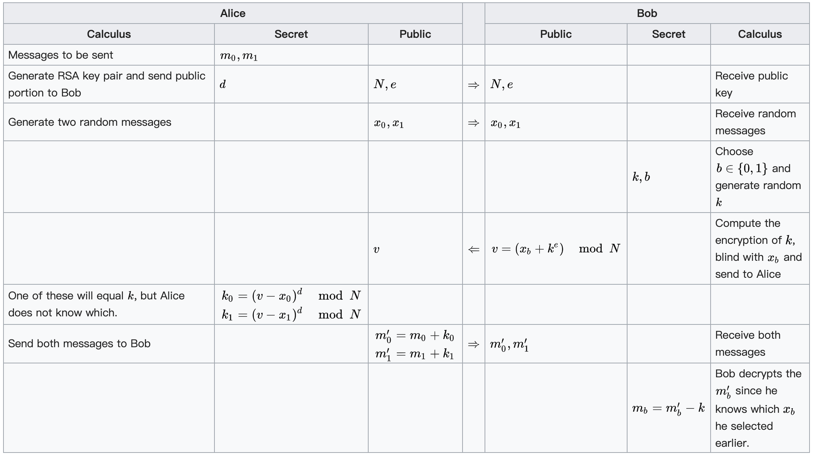

# 不经意传输

## 花絮

我之前给 pwnhub 出过一道关于 oblivious transfer 的题目 [BabyOT](https://mp.weixin.qq.com/s/eAJWraah9OOgJfZOhm4Sqg)

0CTF/TCTF 2020 Finals 也有一道 [Oblivious](https://cr0wn.uk/2020/0ctf-oblivious/)

再加上这道题，三道题每道题的解法都完全不同。它们都是按照[维基百科上面的算法](https://en.wikipedia.org/wiki/Oblivious_transfer)实现的，但问题都在于，m0 和 m1 并不是均匀随机选择的。

我出这道题是因为某同学（就是 114514 那道题的出题人）跟我说，BabyOT 那道题其实 RSA 的 key 每次重新生成也可以做，不过要求字符集不能超过 16 个字符。他很快写好了字符集为连续 16 个字母的简单 demo。但是当我问他能不能把这 16 个字符设定成十六进制的 16 个字符时，我们都没想出来怎么搞。

我最开始以为穷举量太大，无法解出，后来发现其实把 RSA 的 bit 数变小就可以了，RSA 2048 变成 1024，解题需要的穷举量直接开根号。

## 第一问：解密消息

直接按照 oblivious transfer 的协议实现一下另一方就可以正常获取到两条消息中的一条了。

但是，这里有个坑，就是 m0 可能比 n 大。要么多试几次，要么把解出来的 m0 不断加上 n 尝试。

当然，你也可以直接去做第二问，这样第一问也包含在内了。

## 第二问：攻破算法

题目的缺陷在于，m0 和 m1 都是十六进制编码之后的字符串，每个字符都是在 0~9 a~f 这个特定的字符集内的，相比于随机的消息，非常不均匀。



以下的数学公式都是 mod n 意义下的。

仔细思考 1-2 oblivious transfer 的算法，我们可以发现解决这道题的重点：

精心构造 v，可以 k0 和 k1 成比例。如果我们让 `k0 = -scale * k1`，那么就有 `m0' + m1' * scale = (m0 + k0) + (m1 + k1) * scale = m0 + m1 * scale`。

如何让 `k0 = -scale * k1` 呢？我们知道 `k0 ^ e = v - x0` 和 `k1 ^ e = v - x1`，代进去把 v 解出来就行了：

`v = (x0 + scale ^ e * x1) / (1 + scale ^ e)`

只要我们发送这样计算得到的 v，然后拿到 m0' 和 m1' 时计算一下，就可以得到 `m0 + m1 * scale` 了。

首先我们考虑简单的情形，即，m0 和 m1 每个字符都是 0~15 的范围。

字符串编码成的大整数，可以看作是 256 进制的数，如果每一个字节都是 0~15，意味着高 4 个二进制位都是 0。如果我们取 `scale = 16`，那么 `m0 + m1 * scale` 就是把两个数交错拼起来，示意图如下：

```
m0: 01 02 03 04
m1: 0a 0b 0c 0d
```

这样的话

```
m0          : 01 02 03 04
m1 * 16     : a0 b0 c0 d0
m0 + m1 * 16: a1 b2 c3 d4
```

你看，什么信息都没丢，你可以轻松从中还原出 m0 和 m1。

再考虑复杂一点的情形，m0 和 m1 的字符集都是连续 16 个字符，或者说，更弱的条件，字符集的每个字符 mod 16 正好是 0~15。

此时，虽然 m0 和 m1 交织在了一起，但是我们从 `m0 + m1 * scale` 的低字节开始，通过 mod 16 就可以找到 m0 的低字节，然后减掉 m0 的低字节，继续 mod 16 找到 m1 的低字节，这样继续下去，就可以还原 m0 和 m1。

这道题中的情况是，m0 和 m1 的字符集 mod 16 并不恰好是 0~15。这样的话，当我们遇到重复的值，我们无法判定它是多种情况中的哪一个。所以，我们需要一些穷举。

其实，scale 也可以不是 16。我通过统计无法分辨的情况出现的概率，找到了题目字符集下比较好的一个 scale：19。

然后，我们拿到 `m0 + m1 * scale` 后，就可以开始从低字节开始寻找可能的 m0 和 m1 的低字节了，解题脚本需要记住所有的可能情况，然后不断向高字节搜索。

然而，对于我这种用 Python 这样运行速度很慢的语言解题的人来说，穷举量通常会是 2^30 以上的量级，在题目连接的短时间内无法穷举完成。当然，你可以选择不断重试，反正总有机会遇到穷举几分钟之内就找到解的情况。

穷举需要的数量级是一个二项分布（可以看成正态分布）。我的做法是，不断重新连接服务器，每次先计算一下穷举量，蹲到一个穷举量小于 2^24 的情况，分分钟就可以穷举出来。实测重连一些次就可以蹲到一次穷举量足够小的。

[解题脚本](src/solve_ot.py)
