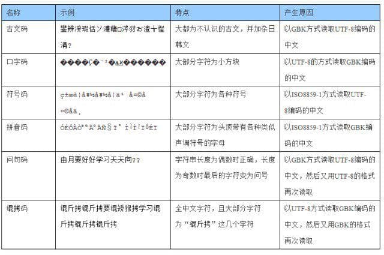

# 从零开始的火星文生活

- 题目分类：general

- 题目分值：150

一年一度的 Hackergame 就要到了，L 同学打算叫上 Q 同学一起去参加，却一连几天都见不到 Q 同学的人影。然而在比赛开始的前一天晚上却收到了来自 Q 同学的邮件：

```
Subject: 绝密！不要外传！！！
Body: 详情见附件
From: Q
```

L 同学打开附件一看，傻眼了，全都是意义不明的汉字。机智的 L 同学想到 Q 同学平时喜欢使用 **GBK 编码**，也许是打开方式不对。结果用 GBK 打开却看到了一堆夹杂着日语和数字的**火星文**……

L 同学彻底懵逼了，几经周折，TA 找到了科大最负盛名的火星文专家 (你)。依靠多年的字符编码解码的经验，你可以破译 Q 同学发来的火星文是什么意思吗？

注：正确的 flag 全部由 **ASCII** 字符组成！

[打开/下载题目](files/gibberish_message.txt)

---

出题&解题 [源代码](./src/generate_and_solve.py)

## 思路

很显然是还原乱码。

也许有人见过这张图：



如果是还原乱码小能手，或者见过上面那张图，就不用我多说了。如果没见过，那么 google 一下部分乱码内容（如 “脦脪鹿楼 乱码”）就能发现一些线索，顺着线索也能找到乱码原因。

## 过程

下载附件之后如直接用 GBK 打开，那就真的是题面里说的“夹杂着日语和数字的火星文”了。恭喜掉进坑，乱码又多了一层（逃

用 UTF-8 打开，看到形如“脦脪鹿楼”的文本，推断是上图中的“古文码”乱码。但是“古文码”明明是“以 GBK 方式读取 UTF-8 编码”造成的，看来“脦脪鹿楼”本来应当是 GBK下看到的结果，却又被存成了 UTF-8。所以第一步是用 GBK 重新编码文本“脦脪鹿楼...”。

然后用 UTF-8 打开，看到形如“ÎÒ¹¥ÆÆÁË”的文本，推断是上图中的“拼音码”乱码。“拼音码”是“以 ISO8859-1 方式读取 GBK 编码”，而现在文本的编码是 UTF-8。所以接下应当用 ISO8859-1 重新编码文本“ÎÒ¹¥ÆÆÁË...”。

然后用 GBK 打开，就能看到可读的汉字和 flag 了（原始编码确实是 GBK 呢！）。不过这里的 flag 全部是从 ASCII 字符转成的全角字符，不能直接复制使用。可以手动替换成 ASCII 字符，或者用其他简便方法变回 ASCII 字符。

[源代码](./src/generate_and_solve.py) 中也给出了一个全角->半角的函数。

## 实践

那么具体用什么手段来解题呢？

### 方法一（不写代码）

例如用 VSCode 的“Select Encoding”功能。

步骤（开始时 UTF-8 打开题目附件）：

1. Save with Encoding -> GBK
1. Reopen with Encoding -> UTF-8
1. Save with Encoding -> ISO8859-1
1. Reopen with Encoding -> GBK

（听说 Notepad++ 很方便，蹲一个其他人的 wp）

### 方法二 （写代码）

见 [源代码](./src/generate_and_solve.py) 中的 solve 函数。

```
def solve(message):
    answer=DBC2SBC(message.encode("gbk").decode("UTF-8").encode("iso-8859-1").decode('gbk'))
    return answer
```

## 为什么出这道题

这道题来源于出题人的真实遭遇：

出题人收到了一封邮件，附件是 GBK 编码的 txt。然后用某邮件客户端 forward 之后，附件就变成了乱码。用 UTF-8 打开，形如“ÎÒ¹¥ÆÆÁË...”；用 GBK 打开，形如“脦脪鹿楼...”。推测是邮件客户端识别了 txt 附件，当作 ISO8859-1 解码之后以 UTF-8 保存……

在出题的时候考虑到，用浏览器/编辑器查看可能会有默认编码的区别。为了让大多数人都能看到形如“脦脪鹿楼”的火星文，最后题目附件中使用 UTF-8 格式（就多了一层 =w=）。

结论就是没事别 GBK，全盘 UTF-8 它不香吗:D

## 另一位出题人的补充

常见的那些编码，穷举一下各种组合就好了
