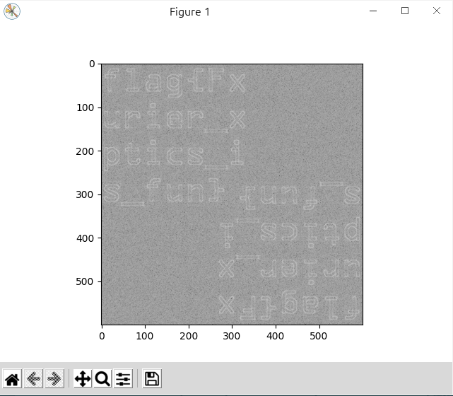
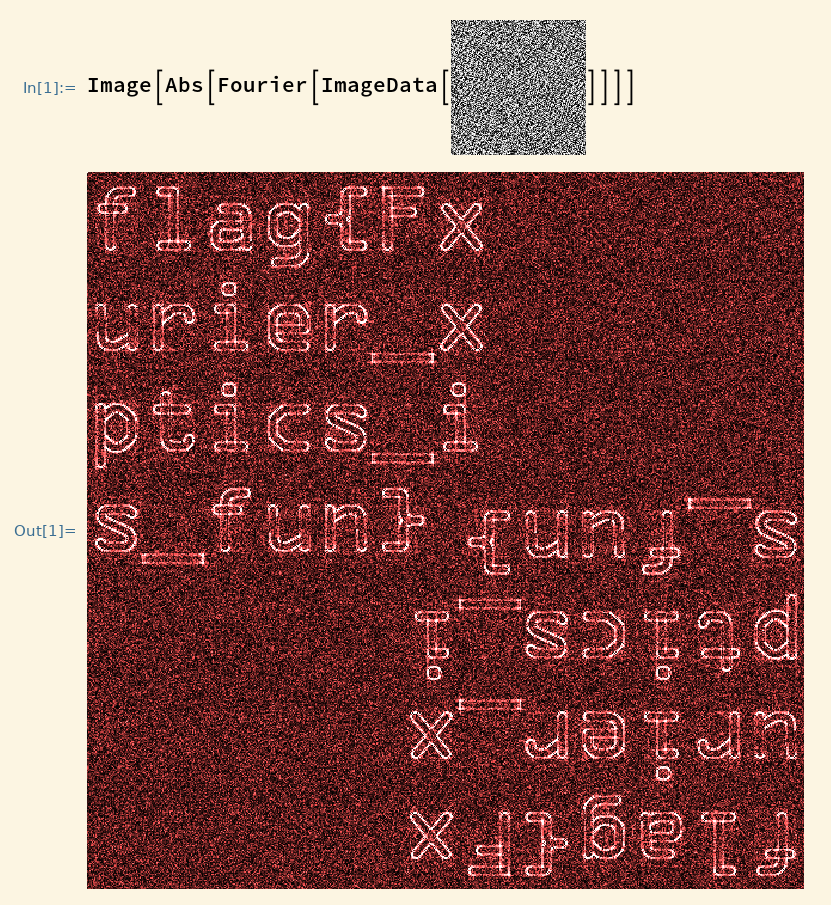

# 来自一教的图片

对图像二维傅里叶变换就结束了。灵感来自于三级大学物理实验“傅里叶光学”。

用 Python 的解法：

```python
import numpy as np
import cv2 as cv
from matplotlib import pyplot as plt
img = cv.imread('./4f_system_middle.bmp', 0)
f = np.fft.fft2(img)
logf = 20*np.log(np.abs(f))
plt.imshow(logf, 'gray')
```



注意 Python 变换之后可能会有一个点值非常大，画图时导致剩下的图像看不出来，手动修复或对数做图（这也是 FFT 的基本操作）即可。对于（逆）变换之后得到的 f ，做图时取实部还是虚部还是模可能需要都试一下，比如取实部只能看到一点线条，取模就能很好地看到图像，但这个应该也不难想到。

用商业软件 Mathematica 的解法：



嗯，就这样结束了。

题目中傅里叶光学是提示，文件名意思是 4F 成像系统中间，就对应物的傅里叶变换平面，也算是提示了，但或许对非物理专业的同学还是有点脑洞吧。

为什么题目中说是模拟呢，因为题目中的图片取的是物傅里叶变换的实部，而一般实验能直接观测光强和相位分布，看电场实部或者虚部还真没听说过。这么做的原因是衍射（就是 FFT ，可见参考[ Matlab 官方文档](https://www.mathworks.com/help/matlab/math/two-dimensional-fft.html)）光强分布不同地方差几个量级，如果这样存到图片里就损失了大量的信息。就算取了实部其实强度信息也基本损失完了，所以图片上除了黑点就是白点，几乎没有中间颜色，但因为实部包含了相位信息，所以仍能成功重构图像，因为[图像的细节信息其实在相位而不是强度中](https://people.eecs.berkeley.edu/~sastry/ee20/vision2/node6.html)。

