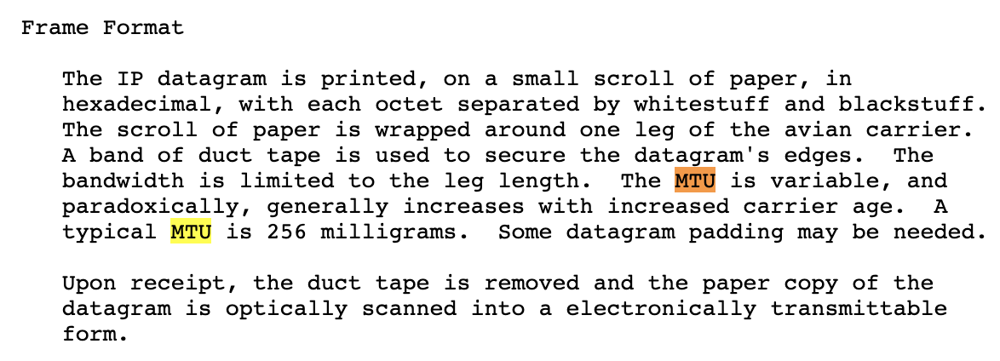

# 猫咪问答++

这道题是 Hackergame 每年几乎一定会有的信息搜索类题目，主要是想让同学们学会一些搜索技巧，此外今年的题目还专门设置了可以在合理时间内枚举的答案。

## 解题过程

> 1. 以下编程语言、软件或组织对应标志是哺乳动物的有几个？
Docker，Golang，Python，Plan 9，PHP，GNU，LLVM，Swift，Perl，GitHub，TortoiseSVN，FireFox，MySQL，PostgreSQL，MariaDB，Linux，OpenBSD，FreeDOS，Apache Tomcat，Squid，openSUSE，Kali，Xfce.
提示：学术上一般认为龙不属于哺乳动物。

根据题意，这道题目的答案是一个整数，且范围是 0~23。

这个题是最麻烦、最不好搜索的，所以先不做。

> 2. 第一个以信鸽为载体的 IP 网络标准的 RFC 文档中推荐使用的 MTU (Maximum Transmission Unit) 是多少毫克？
提示：咕咕咕，咕咕咕。

搜索关键词「第一个以信鸽为载体的 IP 网络标准的 RFC 文档」，找到维基百科或其他网页，得到对应的 RFC 文档编号，查找得到原文：https://tools.ietf.org/html/rfc1149 ，在其中搜索「MTU」得到答案：256。

> 3. USTC Linux 用户协会在 2019 年 9 月 21 日自由软件日活动中介绍的开源游戏的名称共有几个字母？
提示：活动记录会在哪里？

搜索 USTC Linux 用户协会，找到该组织的首页 lug.ustc.edu.cn，然后找到 Wiki 中的自由软件日的活动记录：https://lug.ustc.edu.cn/wiki/lug/events/sfd/ ，得到演讲主题：《开源游戏 Teeworlds》，共有 9 个字母。

> 4. 中国科学技术大学西校区图书馆正前方（西南方向） 50 米 L 型灌木处共有几个连通的划线停车位？
提示：建议身临其境。

尝试使用百度地图、高德地图、谷歌地图的卫星地图，发现过于模糊无法计数，但是百度地图额外提供了全景地图（街景地图），在西区图书馆门口查看即可，共 9 个。

> 5. 中国科学技术大学第六届信息安全大赛所有人合计提交了多少次 flag？
提示：是一个非负整数。

在 USTCLUG 微信公众号中查找今年中国科学技术大学第七届信息安全大赛的宣传新闻稿（https://mp.weixin.qq.com/s/b7VGQ17aWOFOgC8dTynMkw ），得到答案 17098 次。

最后剩下第一题，仅有 24 种可能，手动或者编写脚本枚举尝试即可。当然一个一个地搜索也能得到答案，这里给出参考答案，应该是哺乳动物的有：

Docker，Golang，PHP，Plan 9，GNU，FireFox，MySQL，PostgreSQL，MariaDB，Apache Tomcat，Xfce

其中 GitHub 对应的动物章鱼猫有一定争议，但是从其生理结构判断，不是哺乳动物的可能性更大。

