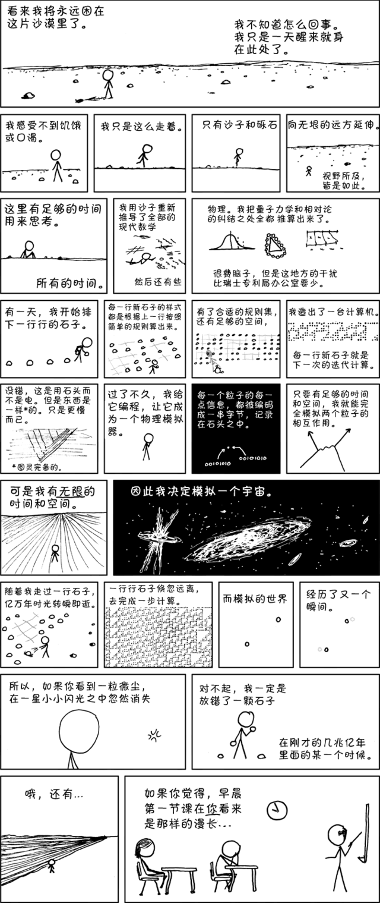

# 超简单的世界模拟器

- 题目分类：general

- 题目分值：蝴蝶效应（100）+ 一石二鸟（150）



以上漫画译自 <https://xkcd.com/505/>，并以 [Creative Commons Attribution-NonCommercial 2.5 License](http://creativecommons.org/licenses/by-nc/2.5/) 许可证发布。

你知道生命游戏（Conway's Game of Life）吗？

你的任务是在生命游戏的世界中，复现出蝴蝶扇动翅膀，引起大洋彼岸风暴的效应。

通过改变左上角 15x15 的区域，在游戏演化 200 代之后，如果被特殊标注的正方形内的细胞被“清除”，你将会得到对应的 flag：

“清除”任意一个正方形，你将会得到第一个 flag。同时“清除”两个正方形，你将会得到第二个 flag。

注: 你的输入是 15 行文本，每行由 15 个 0 或者 1 组成，代表该区域的内容。

[打开/下载题目](http://202.38.93.111:10010/?token={token})

---

这道题**手工构造**与**写代码暴力搜索**都可以解决。

使用搜索引擎搜索“生命游戏”或“Game of Life”都可以找到很多相关的资料，其中会提到生命游戏的演化规则和一些有趣的构造。

## 手工构造解法

为了消除右上角的方块，我们只要放置一个水平移动的“太空船”即可：

```
000000000000000
001111000000000
010001000000000
000001000000000
010010000000000
000000000000000
000000000000000
000000000000000
000000000000000
000000000000000
000000000000000
000000000000000
000000000000000
000000000000000
000000000000000
```

这样可以得到第一个 flag。

消除第二个方块有点困难，因为（比较小的）飞行器只能沿着对角线方向和水平竖直方向飞行，我们的可控制区域比较小，无法让飞行器移动后与方块碰撞。

所以我们可以找一些会扩散比较大的初始状态，例如[这个链接](https://www.conwaylife.com/wiki/Methuselah)里面讲的例子。

一个可行的例子：

```
000000000000000
000000000000000
000000000000000
000000000000000
000000000000000
000000000000000
000000011000000
000000001100000
000000011000000
000000010000000
000000000000000
000000000000000
000000000000000
000000000000000
000000000000000
```
## 暴力解法

直接随机生成 0/1 矩阵，大概几十次就可以找到一个，Python 代码见[solve.py](src/solve.py)
