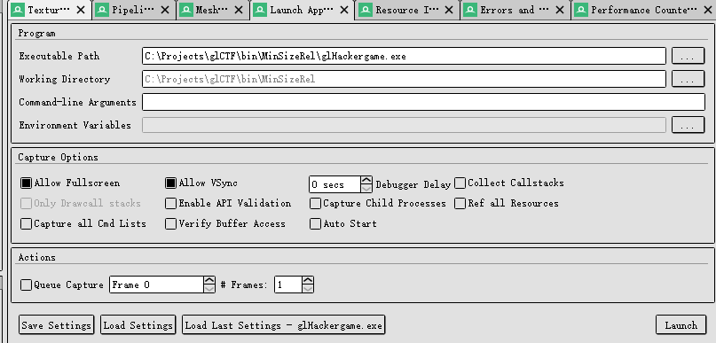
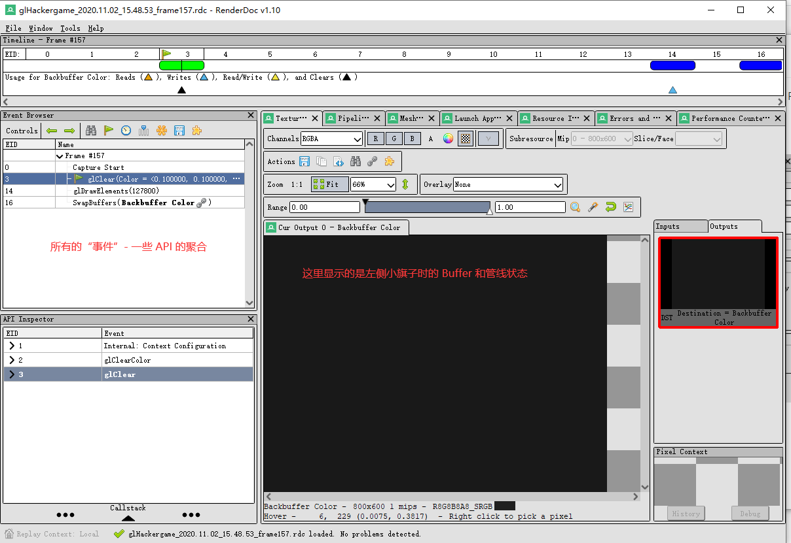
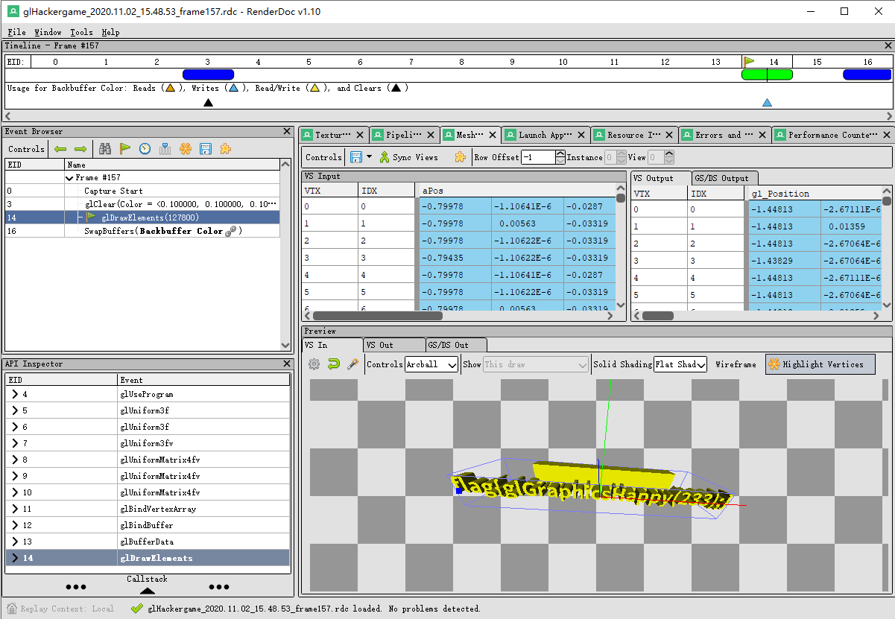

# 超简陋的 OpenGL 小程序

此题目是 LearnOpenGL 教程中『基本光照』一节魔改而成。如果还不清楚基本的渲染管线和 OpenGL 知识的可以参考 LearnOpenGL 教程。

data.bin 里面其实就是一些顶点和索引，我把模型用 Blender 做好之后，用 assimp 进行 Triangulation 并且输出到一个自制的 binary 格式。具体可以参考 challenges 仓库里面本题源码的 util 文件夹。

下面给出两种做法：

## RenderDoc 大法

在图形程序 Debug 中，我们经常会使用 RenderDoc 等类似工具截帧。RenderDoc 会截获并显示 OpenGL 调用。

下载 RenderDoc v1.10，如图所示运行程序。



在打开的窗口中按 F12 截帧，得到如下结果。

我们在 Mesh View 选项卡（如果没有，就先点击 Pipeline，再看 VTX 处的 Mesh View）可以直接看到 Mesh。



好，做完了（

## 魔改 Shader

另一个简单的想法是，只要我们在片段着色器中把挡在 flag 前面的片段 discard 掉，我们就可以在屏幕上看到 flag 了。

于是修改 Shader 如下：

### basic_lighting.fs

```glsl
#version 330 core
out vec4 FragColor;

in vec3 Normal;  
in vec3 FragPos;
in vec3 OrigPos;
  
uniform vec3 lightPos; 
uniform vec3 lightColor;
uniform vec3 objectColor;

void main()
{
    // ambient
    float ambientStrength = 0.1;
    vec3 ambient = ambientStrength * lightColor;
  	
    // diffuse 
    vec3 norm = normalize(Normal);
    vec3 lightDir = normalize(lightPos - FragPos);
    float diff = max(dot(norm, lightDir), 0.0);
    vec3 diffuse = diff * lightColor;
            
    vec3 result = (ambient + diffuse) * objectColor;

    if (OrigPos.z > -0.0)
        discard;

    FragColor = vec4(result, 1.0);
} 
```

### basic_lighting.vs

```glsl
#version 330 core
layout (location = 0) in vec3 aPos;
layout (location = 1) in vec3 aNormal;

out vec3 FragPos;
out vec3 Normal;
out vec3 OrigPos;

uniform mat4 model;
uniform mat4 view;
uniform mat4 projection;

void main()
{
    FragPos = vec3(model * vec4(aPos, 1.0));
    Normal = aNormal;
    OrigPos = aPos;

    gl_Position = projection * view * vec4(FragPos, 1.0);
}
```

## 总结

~~有手就行~~（雾

其实我对自己的这个题目还是不太满意的，毕竟场景实在是太简单了，也没什么美感可言。

不过，又做不出一个太好的藏 Flag 的场景，所以最后就这样不尴不尬的放了上来...