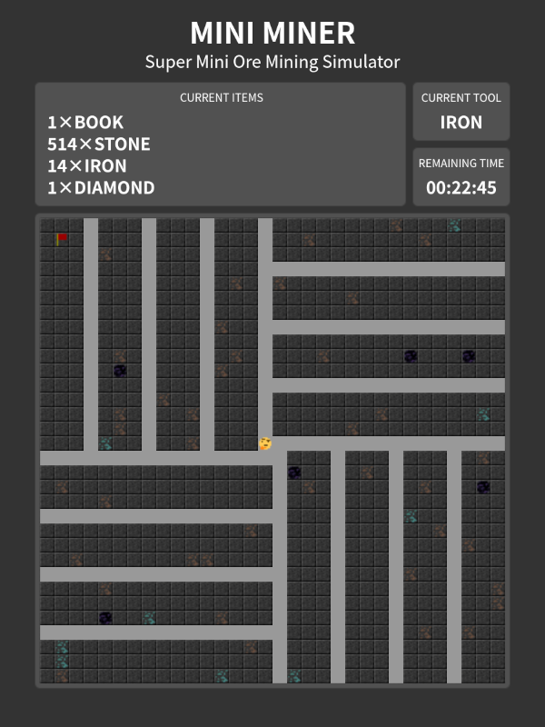

# 超迷你的挖矿模拟器

- 题目分类：math

- 题目分值：300



Mini Miner 是小赵同学从前端到后端全部自主研发的 Web 小游戏。游戏中，玩家将身处一个由石头等各类材料组成的二维矿物世界中。玩家最开始只有一本书和一把石质工具，而最后需要在 30 分钟内合成附魔台才能完成游戏。

材料的硬度由低到高分别是石头（stone）、铁（iron）、钻石（diamond）、黑曜石（obsidian）、以及偶尔出现的 flag。特定硬度的工具，最高只能挖掘更高一级硬度的材料（比如石质工具最高只能挖铁，硬度比铁还要高的材料是无法挖掘出来的），因此玩家需要使用挖掘下来的物品合成更高硬度的工具，每挖掘三个对应材料的物品，工具将自动升级。作为游戏的最终目标，玩家需要收集四个黑曜石和两个钻石，从而和手中的书共同合成附魔台。

游戏地图是几近无限大的，而服务端只需要占用很小的空间存储。小赵同学对这个设计很满意，不过却被仔细阅读过源代码的小郑当头浇了一盆冷水：“这个游戏的地图生成，使用的随机数生成器并不安全……”

小赵有些不以为然——区区随机数生成器而已……不过为了万无一失，小赵还是决定暂时关闭挖掘出 flag 的功能：在源代码中增加条件判断，使得任何硬度的工具都无法挖掘出 flag。

小赵目前觉得高枕无忧了，但……事实真的是这样吗？

## 注

- 本题目的解题过程和前端无关，换言之，只靠分析后端代码和 HTTP 数据包便可解题。
  当然前端代码如果非要看……也不是不可以，本题目源代码中有一份未经混淆的前端代码。
- 后端代码使用 Java 编写，请使用 Java Development Kit 11 或更高版本构建后端源代码。
  Windows 下构建命令是 `gradlew.bat build`，Linux 等平台是 `./gradlew build`。
  构建后请去 `build/libs` 目录寻找 `miniminer.jar`，按 `jar` 通常方式运行即可。
- 后端代码中 `User.java` 用于校验参赛选手 id 和生成动态 flag，和本题目解题过程无关。
- 按后端代码所用到的[依赖库](https://github.com/stleary/JSON-java)要求：“The Software shall be used for Good, not Evil”。
  因此 Mini Miner 是善良而非邪恶的软件。

[打开/下载题目](http://202.38.93.111:10169/?token={token})

---

> 刚才组委会问我「发生甚么事了」，我说「怎么回事」，给我发了几个聊天记录。一看，噢：原来是比赛进行的时候，有几个年轻人，十几二十岁。他们说，哎——有一个排行榜第一的说是要看挖矿模拟器这题怎么解。我说可以，但你盯着地图左上角的那个 Flag 图标不管用，他不服气。哎——我说：小朋友，你用两种工具把这个 Flag 挖下来试试，他挖不动。他说我这题这肯定能挖得下来。我说肯定挖不下来，这是我出的题，300 分的题目，怎么能让你们那么容易解出来——啊。他说他非要用这法子试试，我说可以。我一说，他就啪——地开始写代码，在那儿……很快啊！然后上来就是一个 HTTP 请求，然后又一个 HTTP 请求，我这个后端代码全部防出去了啊——防出去以后自然是传统 CTF，点到为止，他已经输了，如果我这个后端代码发力，一个请求就让他再也不想打 CTF 了，他也承认这几个请求没拿到 Flag。我后端代码暂时不处理了，他突然袭击——又一个 HTTP 请求，我大意了啊，当时就非预期，拿到 Flag 了。我说小伙子你不讲武德你不懂，他说「对不对不起，我不懂规矩」。啊，他说他是乱打的，他可不是乱打的啊——后来听说他 AK 了所有的题，啊——看来他是有备而来。这个年轻人不讲武德，来骗，来非预期我连续 7 年的出题人，这好吗？这不好，我劝这位年轻人耗子尾汁，好好反思，以后不要再犯这样的聪明，小聪明，啊——打 CTF 要以和为贵，要讲武德，不要搞非预期。谢谢朋友们！

以上便是本人精心设计的一道题被非预期解的故事。


由于相较预期解，非预期解简直太容易发现了（结果我没发现），因此我推测大部分拿到 Flag 的选手都是使用的非预期解的方式。

这道题的核心是伪随机数预测，但非预期解完全不需要考虑这一点，甚至不需要读后端代码，因此目的完全没有达到……

不管怎样，先从预期解开始吧。

## 预期解

经过整理，我们可以注意到一共有三种 HTTP 请求比较重要：

* `GET /reset`：重置整个地图。
* `GET /state`：获取特定区域的矿物分布。
* `GET /damage`：在特定位置挖掘方块并获取掉落。

经过试验，我们可以发现 `GET /damage` 请求会带来 3-5s 的延时。

通过阅读源代码：

```java
if (location.getMaterial().harderThan(material)) {
    this.waitFor(LONG_DURATION);
    result.put("dropped", Material.AIR.name()).put("flag", "");
} else {
    this.waitFor(SHORT_DURATION);
    result.put("dropped", location.getMaterial().name());
    result.put("flag", location.getMaterial().flagOf(this.currentUser));
}
```

我们可以注意到判定和挖掘的相关代码是分开的，判定在 3-5s 前，而挖掘在 3-5s 后（`waitFor` 方法是对 `Thread.sleep` 的单纯包装）。

那么我们的目标自然变成了「判定的时候不是 Flag，而挖掘的时候变成了 Flag」。一个自然的想法便出现了：

* 找到一个位置，发起 `GET /damage` 挖掘方块。
* 在 3-5s 的挖掘等级时间内发起 `GET /reset` 重置地图。
* 3-5s 后把该位置挖掘下来，此时该位置正好是 Flag。

---

现在我们的目标变成了寻找这样的位置。左上角的 Flag 看似很好，一直都在——但问题就在于它一直都在，因此判定阶段总是会判定到 Flag（上面的代码中 `harderThan` 总是返回 `true`），从而无法进行到挖掘阶段。

那么到底有没有一开始不是但重置地图后突然是 Flag 的位置呢？这要从 `getMaterial` 方法看起了。

```java
var rng = new Random();
var result = Material.AIR;
if (!Game.this.airLocations.contains(this)) {
    for (var i = 1; i <= 5; ++i) {
        var material = Material.values()[i];
        var modular = material.size + material.size / 2;
        var chunkX = Math.floorDiv(this.x, material.size);
        var chunkY = Math.floorDiv(this.y, material.size);
        var offsetX = Math.floorMod(this.x, material.size);
        var offsetY = Math.floorMod(this.y, material.size);
        rng.setSeed(Game.this.baseSeed ^ (i + 0x6E5D5AF15FA1280BL * chunkX + 0xE9716B1CE6339E6CL * chunkY));
        for (var j = 0; j < material.count; ++j) {
            var randomX = Math.floorMod(rng.nextInt() * ((1 << j) - 1) + chunkX + 1, modular);
            var randomY = Math.floorMod(rng.nextInt() * ((1 << j) - 1) + chunkY + 1, modular);
            if (randomX == offsetX && randomY == offsetY) {
                result = material;
            }
        }
    }
}
return result;
```

我们可以注意到大循环一共针对五种材料（`material` 从 `Material.values()[1]` 到 `Material.values()[5]`）生成，而小循环会生成 `material.count` 次。`floorDiv` 和 `floorMod` 提醒我们一次生成的范围——我们很容易地能从 `Material` 类里找到相应的参数：

```java
private enum Material {
    AIR(1, 1), STONE(1, 1), IRON(32, 16), DIAMOND(32, 32), OBSIDIAN(16, 32), FLAG(2, 16777216);

    // ordinal: air 0, stone 1, iron 2, diamond 3, obsidian 4, flag 5

    private final int count;
    private final int size;

    Material(int count, int size) {
        this.count = count;
        this.size = size;
    }

    private boolean harderThan(Material other) {
        return this == FLAG || this.ordinal() > other.ordinal() + 1;
    }

    private String flagOf(User user) {
        return this == FLAG ? user.getFlag() : "";
    }
}
```

Flag 会以 16777216 为半径生成 2 次（很明显第一次便是地图左上角那个），而黑曜石会以 32 为半径生成 16 次，以此类推。

我们还注意到 `baseSeed` 是操控生成的关键，而每次 `reset` 后 `baseSeed` 会如何变化呢？

```java
this.baseSeed = (this.baseSeed << 3) | (BASE_SEED_RNG.nextInt() & 7);
```

换句话说，如果我们预测成功了 `baseSeed` 的值，那么 `baseSeed` 的下一个值会在 8 个可能的值中出现，那么 Flag 也会在 8 种可能的位置中确定，我们只需要提前找好这样的位置就可以了。

---

我们现在来分析 Java 随机数发生器的默认行为。Java 的随机数发生器和一个 48 bit 的整数息息相关。一个自然想法是爆破 48 bit 的整数，但是数量实在是太多了，那怎么办？

我们不妨将内部整数取名 `innerSeed`，现在来看整个代码中用到的 `setSeed` 和 `nextInt` 两个方法。以下是两个方法的伪代码：

> `setSeed(seed)`:
>
> ```plain
> innerSeed = seed ^ 0x5DEECE66D
> ```
>
> `nextInt()`:
>
> ```plain
> innerSeed = (innerSeed * 0x5DEECE66D + 0xB) & 0xFFFFFFFFFFFF
>
> return innerSeed >>> 16
> ```

在后续代码中，我们会注意到，`nextInt` 的结果在加上一个偏移量后，会以一个数字为模取值，对于黑曜石，这个值为 48。换言之，我们能够得到不超过 16 个 `nextInt` 的结果模 48 的集合。

由于 `48 = 16 * 3`，而 `16` 是 2 的整数次方，因此我们不妨让 `innerSeed` 对应的 `seed` 加上一个整数 `k`（记为 `innerSeed'`），看一看 `nextInt() % 16` 的结果：

> `setSeed(seed)`:
>
> ```plain
> innerSeed         = seed ^ 0x5DEECE66D
>
> innerSeed'        = (seed + k) ^ 0x5DEECE66D
> ```
>
> `nextInt() % 16`:
>
> ```plain
> innerSeed         = ((seed ^ 0x5DEECE66D) * 0x5DEECE66D + 0xB) & 0xFFFFFFFFFFFF
>
> innerSeed'        = (((seed + k) ^ 0x5DEECE66D) * 0x5DEECE66D + 0xB) & 0xFFFFFFFFFFFF
>                   = (((seed ^ 0x5DEECE66D) + k) * 0x5DEECE66D + 0xB) & 0xFFFFFFFFFFFF
>                   = ((seed ^ 0x5DEECE66D) * 0x5DEECE66D + 0xB + k * 0x5DEECE66D) & 0xFFFFFFFFFFFF
>                   = innerSeed + (k * 0x5DEECE66D) & 0xFFFFFFFFFFFF
>
> nextInt() % 16    = (innerSeed >>> 16) % 16
>                   = (innerSeed >>> 16) & 0xF
>
> (nextInt() % 16)' = (innerSeed' >>> 16) % 16
>                   = (innerSeed >>> 16) & 0xF + ((k * 0x5DEECE66D) & 0xFFFFFFFFFFFF >>> 16) & 0xF
>                   = (innerSeed >>> 16) & 0xF + ((k * 0x5DEECE66D) & 0xFFFFFFFF0000 >>> 16) & 0xF + ((k * 0x5DEECE66D) & 0xFFFF >>> 16) & 0xF
>                   = (innerSeed >>> 16) & 0xF + ((k * 0x5DEECE66D) & 0xFFFFFFFF0000 >>> 16) & 0xF + 0
>                   = (innerSeed >>> 16) & 0xF + ((k * 0x5DEECE66D) & 0xF0000 >>> 16) & 0xF + ((k * 0x5DEECE66D) & 0xFFFFFFF00000 >>> 16) & 0xF
>                   = (innerSeed >>> 16) & 0xF + ((k * 0x5DEECE66D) & 0xF0000 >>> 16) & 0xF + ((k * 0x5DEECE66D) >>> 16) & 0xFFFFFFF0 & 0xF
>                   = (innerSeed >>> 16) & 0xF + ((k * 0x5DEECE66D) & 0xF0000 >>> 16) & 0xF + 0
>                   = (innerSeed >>> 16) & 0xF + (k * 0x5DEECE66D) & 0xF0000 >>> 16
> ```

我们注意到，当 `k` 是 `0x100000` 的整数倍时，`(k * 0x5DEECE66D) & 0xF0000 >>> 16` 是严格的 0，换句话说：`nextInt() % 16` 的值，只和 `seed` 的后 20 bit 有关。

这使得我们分组爆破成为可能：

* 首先爆破后 20 bit，检查地图上相应位置模 16 的值是否出现黑曜石。
* 然后集聚所有可能的后 20 bit，再爆破前 28 bit（主要的运算集中在这里）。
* 根据出现的结果预测下一个 `baseSeed` 可能的 8 个值，并发送对应的 8 个挖掘请求。

以上便是预期解的大致流程了。

---

具体示例爆破代码请见 [MiniMinerSolution.java](src/MiniMinerSolution.java)，运行可采用以下方式：

```bash
wget -nc https://repo1.maven.org/maven2/org/json/json/20200518/json-20200518.jar
javac -cp json-20200518.jar MiniMinerSolution.java
java -cp json-20200518.jar:. MiniMinerSolution
```

本人的笔记本电脑 CPU 为「Intel(R) Core(TM) i7-9750H CPU @ 2.60GHz」，大多数情况下 10 分钟之内便可将上面的代码执行完毕。如果使用 C/C++ 编写并针对性优化过的话可能更快。

## 非预期解

上面的预期解基于一个假设：

> 左上角的 Flag 一直都在，因此判定阶段总是会判定到 Flag。

但很可惜，由于本人后端代码的设计失误，这个假设是错的：左上角的 Flag 的对应位置挖空后，Flag 便不复存在了。

因为非预期解如下：

* 针对左上角 Flag 的位置发起 `GET /damage` 挖空。
* 再发起一次 `GET /damage` 并在等待的过程中发起 `GET /reset`。

嗯，没了。


