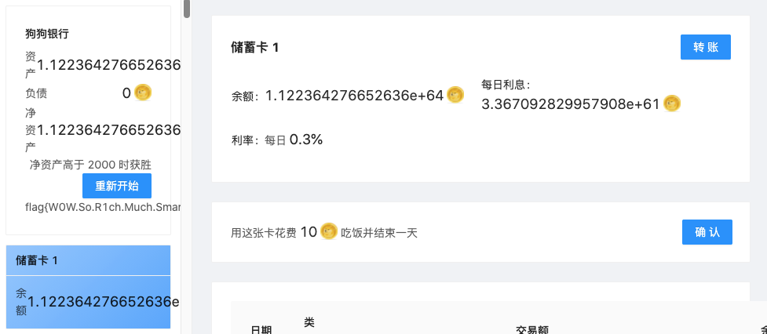

# 小桂的 wwwwwwwriteup (?

### 先说说小桂的背景w

> 这是第一次参加 CTF 比赛w！

小桂擅长的是实用编程啦，所以解的大部分都是可以盲目的写代码就能解决的题嗯w  
（论一个对数理，密码学，二进制逆向全都不感兴趣的高四留学生怎样拿的 #18 (╯‵□′)╯︵┻━┻  
然后就是这里只写了感兴趣的嗯，大家答案都一样的那种就不写啦w

虽然代码写的真的很长也发出来啦，大部分都是用 Kotlin 解的嗯w  
（第一次参赛不知道 Python 有那么多方便的 CTF 库就写了好多轮子 /-\

<br>

## 14: 来自未来的 ~~D-Mail~~

（会有 3020 的考古队看到这个嘛w？:thinking:

1. 把 QR **解析**成 `byte[]` 然后写到文件里（和 rawBytes 不一样哦！
2. 用 tar 解开那个文件w
3. 用 tar 解开 `repo.tar.xz`

### 过程

这道题真的饶了好大一圈哇w  
Python 的库试过的: zbar 装不上，qrtools 不能用来解析，pyzbar 很多都是空的 ;-;  
然后用了 Java 的 ZXing 啦w  
（btw 默认配置会报错找不到 QR 码在图中的哪里（还能在哪里呀 (╯‵□′)╯︵┻━┻  
但是配置好之后 `rawBytes` 加在一起却不能被压缩格式读出来...

当时已经快要放弃了的时候发现 `rawBytes` 和解析出来的字符串的 HEX 对应不上！  
然后才发现 `rawBytes` 是 QR 码读出来的未处理格式啦w  
但是 ZXing 库也不会存没有被 String encode 的解析数据，那怎么办呢w  
啊哈哈哈最后直接改了 ZXing 的源码把 `byte[]` 转换成字符串的地方加进去了

```diff
*** com.google.zxing.qrcode.decoder.DecodedBitStreamParser
@@ -232,235 +234,241 @@
    readBytes[i] = (byte) bits.readBits(8);
  }

+ // CTF: Append the parsed bytes
+ CTFQRKt.setParsedBytes(Bytes.concat(CTFQRKt.getParsedBytes(), readBytes));

  String encoding;
  if (currentCharacterSetECI == null) {
```

<br>

## 15. 狗狗银行 🐶🏦

### 数学方面的

1. 信用卡欠 2099 的话每天的利息是 10.49（10），实际利率是 4.99%
2. 储蓄卡存 167 的话每天的利息是 0.501（1），实际利率是 5.98% 
3. 每张信用卡欠 2099 可以给 12 张储蓄卡付 167，每天 +2 嗯w

### 程序的步骤

1. 初始化：添加 20 组上面说的 12 张储蓄卡和一张信用卡的卡组w
2. 每天用交换卡（是卡1）度过，
3. 每当储蓄卡里面的余额超过 167 到一定程度就转到交换卡上，
4. 每当信用卡里面的欠款超过 2099 就用交换卡还一定程度的款w  
    （转多少是由天数决定的啦，因为前期太高了的话交换卡可能没钱还款，后期太低了的话转账数就太多了）  
    （现在这个是由 `10 + date / 10` 决定的啦）
5. 吃就好啦！🐷

### ~~如何把狗狗银行当做 Exponential Idle 玩~~

6. 下一天开始的时候检测还完信用卡之后每天的净收入是不是大于 10
7. 如果大于的话，  
先把所有的储蓄卡转到卡1，然后把所有的信用卡欠款还回去，
8. 然后开始每天吃就行啦w



是开了小号上挂的啦（笑）  
~~（出题人一觉醒来亏了 11223642766526360638636283649076025898967827371899028387 个亿~~

<br>

## 16. ∫(超基础的数理模拟器)dx

虽然不是最高效的解但是视觉效果超厉害的！！  
**视频链接:** [ビリビリ](https://www.bilibili.com/video/BV16a411c7jN/) | [YouTube](https://youtu.be/8L2TkLmXngQ)

1. 从网页的 HTML 上拿到 LaTeX
2. 转换成 TI Nspire 计算器可以理解的格式w
   1. 替换 (比如说 `\left)` → `)` 和 `{` → `(` 什么的)
   2. 用找括号的方式把 `\frac(n)(d)` 替换成 `(n)/(d)`
   3. 把 `int_(...` 替换成 `integral(equation, x, upper_bound, lower_bound)`
3. 把解析完的算式复制到剪切板，
4. 用 `Robot` 类控制键盘在计算器里面粘贴，回车，复制上一个结果，
5. 读取剪切板中的结果w
6. 四舍五入到六位小数然后发给服务器w

### 为什么不直接用 CAS 库呢？

因为没找到好用的呀...  
Sympy 的解析 Latex 的方法会一直卡住，  
Sage 看了下但是不知道怎样在程序里面控制w  
还有就是因为今年选的 AP Calculus BC 也会用这个计算器解积分啦w

<br>

## 19. 超恶臭的数字论证器 (确信)

原来官方解法那么简单哇w  
代码短 20 倍了！！！(╯‵□′)╯︵┻━┻

### 失败的解法

1. 所有的符号组合穷举一遍（包含不加符号的情况但是不包含括号嗯）
2. 获得距离最短的，然后用 `-~` 和 `~-` 来补上差值w

这样很大的数就要垫很长的 `-~` 所以不行啦w  
（不构思就写代码吃亏惹 +1

### 成功但是很长的解法

1. 把目标分解成质因子（Eg. 1078 → `[2,7,7,11]`)
2. 穷举所有的数字数 n（Eg. `[11,4,5,1,4]` 是六个数字）
3. 把分解后的质因子转成 n 个因子（Eg. `[2,7,7,11]` 转成五个数字的话就是 `[1,2,7,7,11]`)
4. 穷举这个数字数的所有的数字组合（Eg. `[11,4,5,1,4]` 和 `[1,14,5,1,4]` 是两种组合）
5. 穷举所有的因子排列（Eg. `[1,2,7,7,11]` 和 `[11,2,7,1,7]` 是两种不同排列）
6. 获得因子排列和数字组合之间的距离（Eg. `[11,4,5,1,4]` 和 `[11,2,7,1,7]` 的距离是 7）
7. 取最短距离的组合和因子排列w
8. 把每一个数字离因子的距离用 `-~` 和 `~-` 补上（Eg. 4 → 2: `~-~-4`)
9. 合起来组成算式w（Eg. `11*~-~-4*~-~5*1*~-~-~4`)
10. 如果够短的话就提交啦w
11. 如果过长的话回到第一步用 x - 1 重新算然后用 `-~` 给整个算式补上减掉的 1 嗯w

一共写了 288 行 🌚  
果然不应该想太多吧w ;-;  
但是至少从 0 到 114514 没有一个数字解不出来啦w

