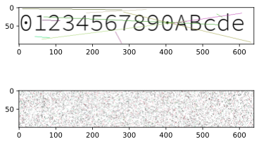
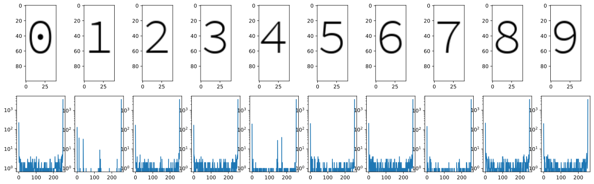

今年肝 paper 实在太忙，只做了一题和自己研究相关的（

顺便膜各位师傅 orz

# 证验码

注意到题目给的是 BMP 格式，显然是为了保存图片的一些统计特征。继续审代码，发现随机数均为真随机，故这个方向没有价值。众所周知字体渲染是有 Anti-aliasing 的，所以每个字都有独特的灰度分布。
故我们可以计算每张图片的灰度分布，再加上预计算每个单独字符的灰度分布，得到直方图，在直方图上做优化即可得到验证码。

注意此处应当使用 L1 而不是 L2 (最小二乘）优化，因为16个字符远少于 26*2+10，结果应当是稀疏的。本题用 L2 也可以得到解，但是如果增加干扰线条的密度，L2 应该会失败。

# 代码

```python
%matplotlib inline

import matplotlib.pyplot as plt
import numpy as np
import random, string
```


```python
import shuffle
```


```python
# !wget https://github.com/adobe-fonts/source-code-pro/raw/release/TTF/SourceCodePro-Light.ttf
```


```python
alphabet = sorted(string.digits + string.ascii_letters)
#code = "".join([random.choice(alphabet) for _ in range(16)])
code = "01234567890ABcde"
print("Code:", code)
```

    Code: 01234567890ABcde


```python
original = shuffle.generate_captcha(code, shuffle_mode=False)
shuffled = shuffle.generate_captcha(code, shuffle_mode=True)
```


```python
plt.subplot(211)
plt.imshow(original)
plt.subplot(212)
plt.imshow(shuffled)
```


    <matplotlib.image.AxesImage at 0x7f8312f56970>





```python
fig, axs = plt.subplots(2, 10, figsize=(20,6))
for i in range(10):
    test_onealpha = np.array(shuffle.img_generate("{}".format(i)))
    axs[0][i].imshow(test_onealpha)
    counts = np.bincount(test_onealpha[:, :, 0].flatten(),minlength=255)
    axs[1][i].plot(counts)
    axs[1][i].set_yscale('log')
```





```python
counts_full = []
for k in range(3):
    counts = np.bincount(np.array(shuffled)[:, :, 0].flatten(),minlength=256)
    counts[255] = 0
    counts_full.append(counts)
counts_full = np.hstack(counts_full)
print(counts_full.shape)
```

    (768,)


```python
# %pip install cvxpy
```


```python
import cvxpy as cvx
```


```python
bases = []

for i in range(len(alphabet)):
    bases_rgb = []
    for k in range(3):
        test_onealpha = np.array(shuffle.img_generate("{}".format(alphabet[i])))
        counts = np.bincount(test_onealpha[:, :, k].flatten(),minlength=256)
        counts[255] = 0
        bases_rgb.append(counts)
    bases.append(np.hstack(bases_rgb))

A = np.vstack(bases).T
print(A.shape)
print(A.T)
```

    (768, 62)
    [[224   5   2 ...   3   5   0]
     [134   1   1 ...   0   2   0]
     [171   2   1 ...   3   4   0]
     ...
     [ 94   1   2 ...   2   6   0]
     [118   4   3 ...   2   6   0]
     [195   2   2 ...   1   3   0]]
    /usr/lib/python3.8/site-packages/ipykernel/ipkernel.py:287: DeprecationWarning: `should_run_async` will not call `transform_cell` automatically in the future. Please pass the result to `transformed_cell` argument and any exception that happen during thetransform in `preprocessing_exc_tuple` in IPython 7.17 and above.
      and should_run_async(code)


```python
import PIL
shuffled = PIL.Image.open("./captcha_shuffled.bmp")
# Solve actual problem
counts_full = []
for k in range(3):
    counts = np.bincount(np.array(shuffled)[:, :, 0].flatten(),minlength=256)
    counts[255] = 0
    counts_full.append(counts)
counts_full = np.hstack(counts_full)
print(counts_full.shape)
```

    (768,)
    /usr/lib/python3.8/site-packages/ipykernel/ipkernel.py:287: DeprecationWarning: `should_run_async` will not call `transform_cell` automatically in the future. Please pass the result to `transformed_cell` argument and any exception that happen during thetransform in `preprocessing_exc_tuple` in IPython 7.17 and above.
      and should_run_async(code)


```python
vx = cvx.Variable(len(alphabet))
objective = cvx.Minimize(cvx.norm(A*vx - counts_full, 1))
constraints = [vx >= 0]
prob = cvx.Problem(objective, constraints)
result = prob.solve(verbose=True)
```

    
    ECOS 2.0.7 - (C) embotech GmbH, Zurich Switzerland, 2012-15. Web: www.embotech.com/ECOS
    
    It     pcost       dcost      gap   pres   dres    k/t    mu     step   sigma     IR    |   BT
     0  -2.788e-13  +1.258e-12  +5e+05  8e-01  4e-01  1e+00  3e+02    ---    ---    1  2  - |  -  - 
     1  +4.640e+03  +4.675e+03  +2e+05  3e-01  1e-01  3e+01  1e+02  0.7401  2e-01   1  1  1 |  0  0
     2  +5.846e+03  +5.861e+03  +9e+04  1e-01  4e-02  1e+01  6e+01  0.6585  8e-02   1  1  1 |  0  0
     3  +5.968e+03  +5.970e+03  +1e+04  1e-02  3e-03  2e+00  6e+00  0.9494  6e-02   1  1  1 |  0  0
     4  +6.080e+03  +6.080e+03  +3e+03  4e-03  1e-03  5e-01  2e+00  0.7566  6e-02   1  1  1 |  0  0
     5  +6.151e+03  +6.152e+03  +2e+03  2e-03  6e-04  3e-01  1e+00  0.6536  5e-01   1  1  1 |  0  0
     6  +6.193e+03  +6.193e+03  +9e+02  1e-03  3e-04  1e-01  5e-01  0.6015  1e-01   1  1  1 |  0  0
     7  +6.198e+03  +6.198e+03  +8e+02  1e-03  3e-04  1e-01  5e-01  0.2129  7e-01   1  1  1 |  0  0
     8  +6.216e+03  +6.216e+03  +6e+02  9e-04  2e-04  1e-01  3e-01  0.5360  4e-01   1  1  1 |  0  0
     9  +6.230e+03  +6.230e+03  +3e+02  6e-04  1e-04  6e-02  2e-01  0.6585  4e-01   1  1  1 |  0  0
    10  +6.244e+03  +6.244e+03  +2e+02  3e-04  5e-05  3e-02  1e-01  0.6652  2e-01   1  1  1 |  0  0
    11  +6.249e+03  +6.249e+03  +1e+02  2e-04  3e-05  2e-02  7e-02  0.5025  4e-01   1  1  1 |  0  0
    12  +6.255e+03  +6.255e+03  +6e+01  1e-04  2e-05  1e-02  4e-02  0.7639  3e-01   1  1  1 |  0  0
    13  +6.259e+03  +6.259e+03  +3e+01  5e-05  7e-06  6e-03  2e-02  0.6280  1e-01   1  1  1 |  0  0
    14  +6.261e+03  +6.261e+03  +1e+01  2e-05  3e-06  2e-03  7e-03  0.7859  2e-01   1  1  1 |  0  0
    15  +6.262e+03  +6.262e+03  +4e+00  8e-06  1e-06  9e-04  2e-03  0.7343  1e-01   1  1  1 |  0  0
    16  +6.263e+03  +6.263e+03  +8e-01  2e-06  2e-07  2e-04  5e-04  0.8474  6e-02   1  1  1 |  0  0
    17  +6.263e+03  +6.263e+03  +3e-01  7e-07  9e-08  8e-05  2e-04  0.6258  6e-02   1  1  1 |  0  0
    18  +6.263e+03  +6.263e+03  +4e-02  7e-08  1e-08  8e-06  2e-05  0.9127  2e-02   1  1  1 |  0  0
    19  +6.263e+03  +6.263e+03  +2e-03  3e-09  4e-10  4e-07  1e-06  0.9579  2e-04   2  1  1 |  0  0
    20  +6.263e+03  +6.263e+03  +2e-05  3e-11  5e-12  4e-09  1e-08  0.9890  1e-04   2  1  1 |  0  0
    
    OPTIMAL (within feastol=3.4e-11, reltol=2.7e-09, abstol=1.7e-05).
    Runtime: 0.048064 seconds.
    
    /home/fan/.local/lib/python3.8/site-packages/cvxpy/expressions/expression.py:550: UserWarning: 
    This use of ``*`` has resulted in matrix multiplication.
    Using ``*`` for matrix multiplication has been deprecated since CVXPY 1.1.
        Use ``*`` for matrix-scalar and vector-scalar multiplication.
        Use ``@`` for matrix-matrix and matrix-vector multiplication.
        Use ``multiply`` for elementwise multiplication.
    
      warnings.warn(__STAR_MATMUL_WARNING__, UserWarning)


```python
print(*zip(alphabet, vx.value.round(0)))
```

    ('0', 1.0) ('1', 0.0) ('2', -0.0) ('3', 0.0) ('4', -0.0) ('5', 1.0) ('6', 0.0) ('7', -0.0) ('8', 0.0) ('9', -0.0) ('A', 0.0) ('B', -0.0) ('C', -0.0) ('D', -0.0) ('E', 1.0) ('F', 0.0) ('G', -0.0) ('H', 1.0) ('I', -0.0) ('J', -0.0) ('K', 0.0) ('L', 1.0) ('M', -0.0) ('N', -0.0) ('O', 0.0) ('P', 1.0) ('Q', -0.0) ('R', -0.0) ('S', 1.0) ('T', -0.0) ('U', 0.0) ('V', 0.0) ('W', 1.0) ('X', 1.0) ('Y', 0.0) ('Z', 1.0) ('a', -0.0) ('b', 0.0) ('c', 0.0) ('d', 0.0) ('e', -0.0) ('f', -0.0) ('g', -0.0) ('h', -0.0) ('i', -0.0) ('j', -0.0) ('k', -0.0) ('l', 2.0) ('m', -0.0) ('n', -0.0) ('o', -0.0) ('p', -0.0) ('q', 0.0) ('r', -0.0) ('s', 1.0) ('t', -0.0) ('u', 1.0) ('v', 0.0) ('w', 1.0) ('x', 1.0) ('y', -0.0) ('z', -0.0)

