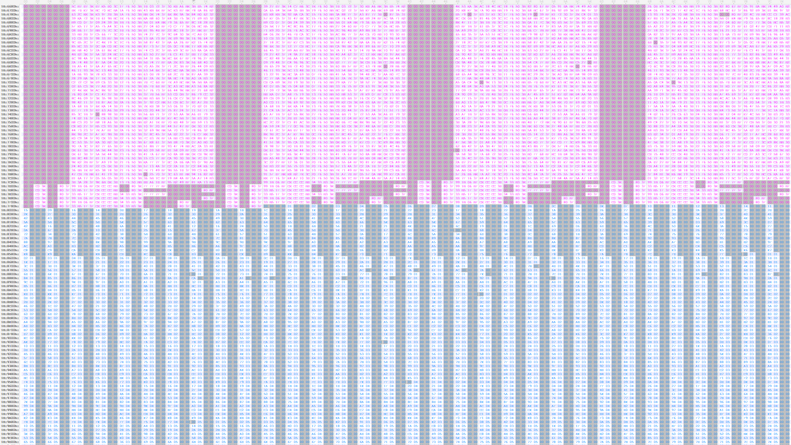

# 超简陋的 OpenGL 小程序

不会魔改 Shader 怎么办，那我们还可以从 data.bin 入手啊 hhh

把 data.bin 拖到十六进制编辑器里打开，为了方便分析把所有零字节用灰色都高亮，同时把字体调到最小

快速拖动滚动条可以发现整个文件可以分为三部分：

- 第一部分长度为 8 字节，偏移量为 0x0 ~ 0x7 字节（黑色）
- 第二部分长度为 1802144 字节，偏移量为 0x8 ~ 0x1B7FA7 字节（紫色）
- 第三部分长度为 511200 字节，偏移量为 0x1B7FA8 ~ 0x234C87 字节（蓝色）




先跳过第一部分，根据第二部分的 8 个零字节出现规律可以猜测第二部分是以 8 个 4 字节为一组。其中每组的前 3 个 4 字节几乎没有出现零字节，第 4 ~ 6 个 4 字节偶尔出现零字节且很有规律，而最后 2 个 4 字节几乎都是零字节（除了最后一小部分）

观察第 4 ~ 6 个 4 字节，出现零字节的大多数都是 0xBF800000、0x00000000、0x3F800000，对应的是浮点数中的 -1、0、1，猜测第 4 ~ 6 个 4 字节表示了顶点的法向量

那么前 3 个 4 字节就表示了顶点的坐标，至于后 2 个 4 字节表示了什么，先不管了（后来看了下源码，其实是贴图的坐标，不过也不影响做题）

继续看第三部分，零字节基本都出现在了每 4 字节中的高 2 字节上，而且前半部分第 2 字节从 0x00 开始逐渐增至 0x98，猜测第三部分是以 4 个字节为一组，并且都是 int 或 unsigned int（然而并没有用到符号位，所以就当是 int 吧）

回来看第一部分，跟第三部分类似，猜测是由两个 int 组成的，值分别为 56317 和 127800，计算发现 56317 \* 4 \* 8 = 1802144（第二部分的长度），127800 \* 4 = 511200（第三部分的长度），那么很明显程序是读取第一部分获得长度后，再根据长度去读取剩下两个部分的

对第三部分里的 int 值分析，最小值是 0，最大值是 56315，接近第二部分的长度，猜测这一部分是用来存组成每个面的顶点索引，一般来说一个面都是由三个顶点组成的三角形，所以先假设这种情况

接下来就可以写代码根据这些信息去生成一个模型文件，然后放进模型查看器里看了，这里我生成了 [.obj 文件](https://en.wikipedia.org/wiki/Wavefront_.obj_file)

```python
import struct

from more_itertools import chunked

with open('./data.bin', 'rb') as f:
    data = f.read()

(vertices_count, face_indecies_count) = struct.unpack_from('< i i', data, 0)
(vertices_raw, face_indecies_raw) = struct.unpack_from(f'{vertices_count * 4 * 8}s {face_indecies_count * 4}s', data, 8)

vertices = list(chunked(struct.unpack(f'< {len(vertices_raw) // 4}f', vertices_raw), 8))
face_indecies = list(chunked(struct.unpack(f'< {len(face_indecies_raw) // 4}i', face_indecies_raw), 3))

with open('./model.obj', 'w', encoding='utf-8') as f:
    for vertex in vertices:
        (x, y, z) = vertex[:3]
        f.write(f'v {x} {y} {z}\n')
    for vertex in vertices:
        (x, y, z) = vertex[3:6]
        f.write(f'vn {x} {y} {z}\n')
    for face in face_indecies:
        (x, y, z) = face
        f.write(f'f {x + 1}//{x + 1} {y + 1}//{y + 1} {z + 1}//{z + 1}\n')
```

生成后在模型查看器里（例如 [three.js editor](https://threejs.org/editor/) 或者 Windows 10 自带的）导入文件即可


**那么如果一个面不是由三个顶点组成的三角形呢？**

我们既然都拿到了顶点坐标了，那直接把所有点画出来其实也行

```python
import matplotlib.pyplot as plt
import numpy as np

positions = [vertex[:3] for vertex in vertices]
(xs, ys, zs) = np.array(positions).transpose(1, 0)

fig = plt.figure()
ax = fig.add_subplot(111, projection='3d')
ax.set_box_aspect((np.ptp(xs), np.ptp(ys), np.ptp(zs)))
ax.scatter(xs, ys, zs, s=0.1)

plt.show()
```


