# Hackergame 2020 Write Up

## web

### 签到题

web题当然要先看源码了

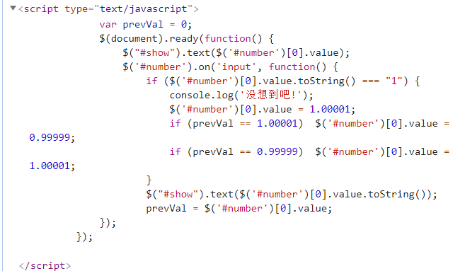

再就是改值、提交

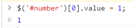

so easy~

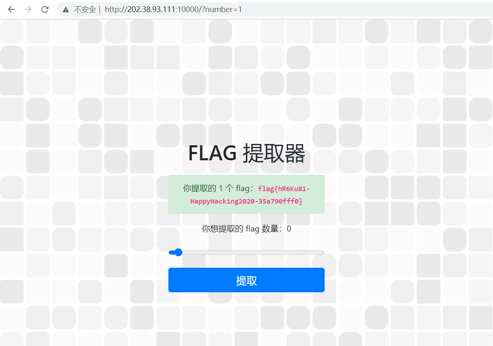

flag获取成功：`flag{hR6Ku81-HappyHacking2020-35a790fff0}`

### 2048

首先F12看下源码，看到了一个有趣的东西

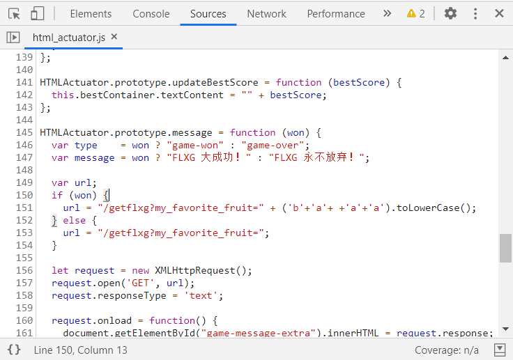

~~这么好的东西当然要拖到console里面去啊~~

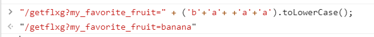

然后就出来了此题的 “flxg” 

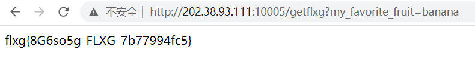

flxg获取成功：`flxg{8G6so5g-FLXG-7b77994fc5}`

## general

### 一闪而过的flag

直接打开是会闪，但是，你闪归你闪，我直接用cmd打开，你总不能 ~~把我cmd窗口关掉吧~~ 还继续闪吧

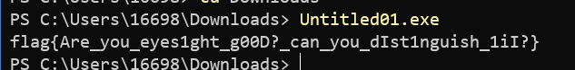

flag获取成功：`flag{Are_you_eyes1ght_g00D?_can_you_dIst1nguish_1iI?}`

### 猫咪问答++

> 2. 第一个以信鸽为载体的 IP 网络标准的 RFC 文档中推荐使用的 MTU (Maximum Transmission Unit) 是多少毫克？

这个很好找，链接奉上：<https://tools.ietf.org/html/rfc1149>

> 3. USTC Linux 用户协会在 2019 年 9 月 21 日自由软件日活动中介绍的开源游戏的名称共有几个字母？

~~谷歌一下，你就知道~~ <https://news.ustclug.org/2019/09/2019-sfd-ustc/>

> 5. 中国科学技术大学第六届信息安全大赛所有人合计提交了多少次 flag？


至于剩下的... 懒得找了，直接暴力吧

> 1. 以下编程语言、软件或组织对应标志是哺乳动物的有几个？
> Docker，Golang，Python，Plan 9，PHP，GNU，LLVM，Swift，Perl，GitHub，TortoiseSVN，FireFox，MySQL，PostgreSQL，MariaDB，Linux，OpenBSD，FreeDOS，Apache Tomcat，Squid，openSUSE，Kali，Xfce.

> 4. 中国科学技术大学西校区图书馆正前方（西南方向） 50 米 L 型灌木处共有几个连通的划线停车位？

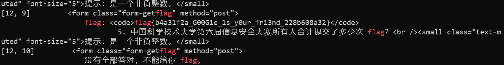

附上代码：

```shell
for((i=1;i<=23;i=($i+1))); do for((j=1;j<=30;j=($j+1))); do echo "[$i, $j] $(curl -s 'http://202.38.93.111:10001/' --data "q1=$i&q2=256&q3=9&q4=$j&q5=17098" -H "Cookie: PHPSESSID=******; session=******" | grep 'flag.*')" ; done ; done
```

flag获取成功：`flag{b4a31f2a_G00G1e_1s_y0ur_fr13nd_228b608a32}`

### 233同学的 Docker

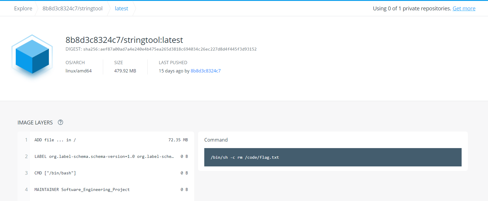

众所周知，Docker 镜像是分层存储的，所以这道题可以很轻松地解出来。

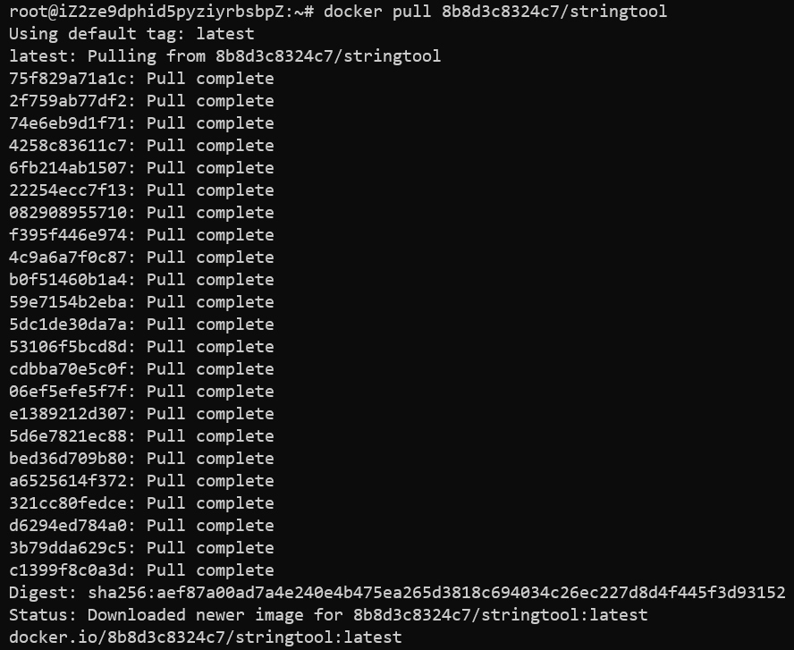

先pull下来镜像。

```shell
docker inspect 8b8d3c8324c7/stringtool
```

然后查看镜像的元信息，下面是简化版的结果（json格式）

```json
[
    {
        "Id": "sha256:be6d023618d199e0ec7448f70e5e47a00c6c2b79777ad5e2d312a6f74d6ad56b",
        "RepoTags": [
            "8b8d3c8324c7/stringtool:latest"
        ],
        "RepoDigests": [
            "8b8d3c8324c7/stringtool@sha256:aef87a00ad7a4e240e4b475ea265d3818c694034c26ec227d8d4f445f3d93152"
        ],
        "Parent": "",
        "Comment": "",
        "Created": "2020-10-16T12:51:09.221320098Z",
        "Container": "d2f452fddd5c71c8c57a29d67f29c69ffac419440d57664dad6e4ba1f0eff8a1",
        "GraphDriver": {
            "Data": {
                "LowerDir": "/var/lib/docker/overlay2/e5ae9d16844b8a8f5a943dec4172e04f6cdd283af181e1d17315c6b4df883eb1/diff:/var/lib/docker/overlay2/e394091d4d369e4b39d51389ada0156f8df91164e7928ca705321012b3164171/diff:/var/lib/docker/overlay2/de25217d9ac38b566f5e21050325fc0b712b81eb76d8bf949535efe4048150dc/diff:/var/lib/docker/overlay2/44b1b520904edb80dde2e1cfd0bb4e8cc272bcdb3abfbecb9f7c58c66fda461f/diff:/var/lib/docker/overlay2/77e74c48f3d794c594fcbbaafb1de3de084d5680c7361eb3c694cd74bb5ba7d2/diff:/var/lib/docker/overlay2/e2f50b5ba8b187a859f175daf953b5f1244ca210e65fc281cebbb490c1736090/diff:/var/lib/docker/overlay2/c49ab73078dbf960574fba1cb22cbfa6cb80300213ef9ce0e8541204181b2ea6/diff:/var/lib/docker/overlay2/cdca87b3621cb3bafbb198f6b90aa229e225eec78f0a58b0b17415bc0c252c3c/diff:/var/lib/docker/overlay2/c75c733f9469403b6677b86de747b78eee86b342e4b8cb67301b62bc37148f0d/diff:/var/lib/docker/overlay2/6c5b7e0fcab90d5b9e95987fa4901fdaca167e20078efc15255025edaa3bffe5/diff:/var/lib/docker/overlay2/15ec67c13cb10d0efe49ffa8038af1e4e15ee4ace3d0e3cbb3b35373438162ee/diff:/var/lib/docker/overlay2/63919ff473de17fc4a04bebe8e3163ac9a6615e860c8d154c58b40e83cae3008/diff:/var/lib/docker/overlay2/301804bb5ea02f0be82935af0838aae81fb796470e35ca799c010ee551c63901/diff:/var/lib/docker/overlay2/837182ab20cd4356c084efceb23eaf81921b199deeb4260a3bb8bd3690bdf248/diff:/var/lib/docker/overlay2/83f0cdea53e8d31281de36413a4d5e5ba9aef2fce54733ab8686bdc04a0c7736/diff:/var/lib/docker/overlay2/fad7f08992db8ca5ee5d731ccc21ac6746107798714b453e6fb21f23f0de8ed6/diff:/var/lib/docker/overlay2/2742f86c6ff24a479ff553458418cee16e1d90c3ba6e51f28599fcd2143108c0/diff:/var/lib/docker/overlay2/f0ea5cad64532fdff5edaaad4880132a8811bbd04019a2b216710dfda4bb829b/diff:/var/lib/docker/overlay2/af49c2f259440c1d94b6843258a68201bb3a37b6ec0e20b7e1dc6773de29e5eb/diff:/var/lib/docker/overlay2/9d6591c82c88ba3d461cf4d20c03e2a4b064454e3bbe9718b26e97eaf1fa703b/diff:/var/lib/docker/overlay2/eb71979f0abedbf4854bd95a364726dd7dc21b779512dad582bdefe87b24efb3/diff:/var/lib/docker/overlay2/b14870a3b3e75ac73506b96ad8de3ac918b6d1dbb8cb702e56b1d879910ee8d7/diff",
                "MergedDir": "/var/lib/docker/overlay2/9d9609e4438067f4a2b0d26aeefab51a6e0abb58262e571b5fe2558955f271b7/merged",
                "UpperDir": "/var/lib/docker/overlay2/9d9609e4438067f4a2b0d26aeefab51a6e0abb58262e571b5fe2558955f271b7/diff",
                "WorkDir": "/var/lib/docker/overlay2/9d9609e4438067f4a2b0d26aeefab51a6e0abb58262e571b5fe2558955f271b7/work"
            },
            "Name": "overlay2"
        }
    }
]
```

查看 diff 文件夹：

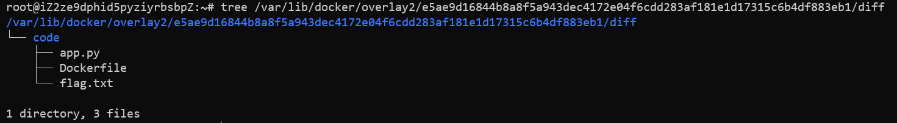

然后就能看到文件内容了~

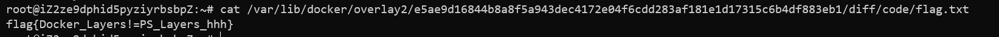

flag获取成功：`flag{Docker_Layers!=PS_Layers_hhh}`
